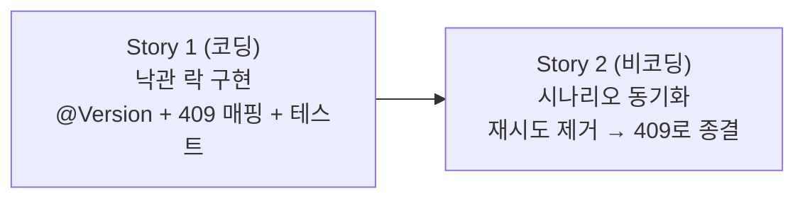

# 동시 재고 변경 충돌 — Story 목록

선행: [../../modeling/structure-concurrent.md](../../modeling/structure-concurrent.md), [ADR-012](../../adr/adr-012-optimistic-locking.md)

## 전체 흐름

구현 먼저, 문서 동기화 나중. 시나리오(scenarios.md)에 재시도 흐름이 남아 있어 코드 완성 후 맞춰 닫는다.

---

## Story 1 — 낙관 락 충돌 → 409 매핑

### 목적

`@Version`은 `BaseEntity`에 이미 있어 충돌 감지 자체는 동작한다. 이 Story는 충돌 시 발생하는 `ObjectOptimisticLockingFailureException`을 `ApiExceptionHandler`가 409 Conflict로 매핑하는 것과 그 동작을 테스트로 검증하는 데까지다. 재시도는 없다.

### 실행 완료 기준

- `ObjectOptimisticLockingFailureException`이 409 Conflict로 응답되는 상태 (슬라이스 테스트)
- 버전 불일치 저장 시도 시 예외가 발생하는 상태 (영속 테스트)

### ADR

- 낙관 락 선도입 결정 → [ADR-012](../../adr/adr-012-optimistic-locking.md)

---

## Story 2 — 시나리오 동기화 (비코딩)

### 목적

`scenarios.md`의 동시 수량 변경 충돌 시나리오에서 재시도 흐름("최신 수량 재조회 · 차감 · 저장")을 제거하고 409로 응답·종결하는 흐름으로 맞춘다. 코드 구현과 시나리오가 일치하지 않는 상태를 닫는다.

### 실행 완료 기준

- `scenarios.md`의 동시 충돌 시나리오 다이어그램이 409 응답으로 종결되는 상태
- 재시도 분기가 제거된 상태

---
