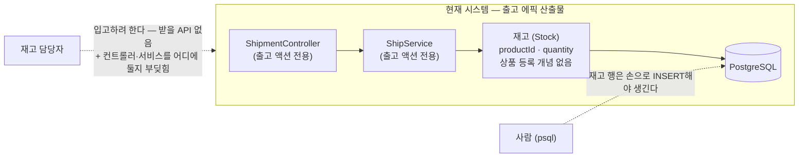

# 문제 정의 — 입고 처리 (AS-IS)

## 흐름 설명

재고 담당자가 입고(재고를 늘리는 일)를 하려 해도, 현재 시스템엔 그 요청을 받을 API가 없다. 출고 에픽은 재고를 *줄이는* 길(출고 API → 서비스 → 재고 차감 → 저장)만 냈고, 재고를 *늘리거나 처음 만드는* 경로는 비어 있다.

게다가 재고 행 자체가 지금은 애플리케이션으로 생기지 않는다 — 출고를 확인할 때도 psql로 직접 INSERT해 씨앗 데이터를 넣었다. "새 재고가 시스템에 정상적으로 들어오는" 경로가 아예 없다.

입고 요구에는 한 겹이 더 있다(과제 §입고): *등록되지 않은 상품이면 신규 등록 후 입고*. 그런데 출고 에픽은 상품(Product)을 별도로 두지 않고 재고에 `productId` 문자열 컬럼으로만 박았다(ADR-005 수량 컬럼, Movement 미구현). 그래서 "상품이 등록돼 있나/아닌가"를 가를 상품 레지스트리도, '신규 등록'이라는 개념도 코드에 없다.

마지막으로, 입고는 기존 계층 구성과 부딪힌다. 지금 웹·서비스 계층은 출고 액션 하나에 맞춰 `ShipmentController`·`ShipService`로, 액션 전용 이름으로 1개씩 서 있다. 입고를 더하면 이 계층을 어디에 둘지 — 액션별로 또 늘릴지, 하나로 묶을지 — 가 정면으로 걸린다. 백로그 결정 메모(컨트롤러·서비스 입자 규약)가 "두 번째 기능이 들어올 때 결정"이라 미뤄둔 바로 그 지점이고, 입고 에픽이 그 트리거다. (어떻게 둘지는 explore-solutions의 자리.)

이 에픽이 닫을 격차는 셋이다 — *재고를 늘리는 입고 경로의 부재*, *미등록 상품을 처음 들일 때 기댈 상품 등록 개념의 부재*, 그리고 *입고가 합류할 때 출고 액션 전용으로 선 계층 구성의 충돌*.

## 컴포넌트 설명

- **재고 담당자** — 입고를 일으키려는 주체. 지금은 출고만 맡길 수 있고, 입고를 받아줄 곳이 없다.
- **ShipmentController** — 출고 HTTP 요청을 받는 웹 진입점. 출고 액션 전용 이름·범위라, 입고가 들어오면 여기에 합칠지 새 컨트롤러를 둘지 부딪힌다.
- **ShipService** — 출고 오케스트레이션(조회 → 차감 → 저장). 마찬가지로 출고 전용이라, 입고 유스케이스를 같은 서비스에 얹을지 분리할지가 걸린다.
- **재고 (Stock)** — 상품별 현재 수량. `productId`를 문자열 컬럼으로만 들어 상품을 따로 등록·식별하는 개념이 없다. 입고의 "미등록 상품 신규 등록"이 기댈 대상이 비어 있다.
- **PostgreSQL** — 재고를 영속하는 DB. 재고 행은 지금 애플리케이션이 아니라 psql 수동 INSERT로만 생긴다.
- **사람 (psql)** — 재고 행을 직접 꽂는 현재의 임시 통로. 입고 경로가 없어, 새 재고가 존재하려면 사람이 DB에 손을 대야 한다.
