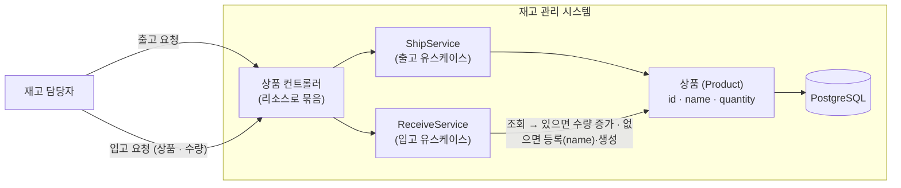

# 해결 방향 — 입고 처리 (TO-BE)

## 흐름 설명

재고 담당자가 입고든 출고든 같은 리소스(상품)에 대고 요청하면, 상품 컨트롤러가 한곳에서 받아 유스케이스별 서비스로 넘긴다. 출고는 `ShipService`, 입고는 `ReceiveService`. **컨트롤러는 리소스로 묶어 하나로 두되, 서비스는 유스케이스별로 나눈다** — 한 서비스가 여러 행위를 떠안아 비대해지는 걸 막는다. 이로써 AS-IS의 셋째 격차(출고 액션 전용으로 선 계층 구성의 충돌)가 풀린다. 출고 전용이던 `ShipmentController`는 리소스로 묶인 상품 컨트롤러로 합류한다.

핵심 도메인은 **상품(Product)** 하나로, 과제의 데이터 구조 `{id, name, quantity}`를 그대로 따른다. 재고를 상품과 따로 두지 않고, 상품이 자기 보유 수량(`quantity`)을 직접 든다 — MVP에서 상품과 재고가 1:1이라 하나로 합치는 게 단순하다. 출고 에픽이 세운 재고(`Stock`, `productId`·`quantity`)를 이 상품으로 바꾸는 셈이다.

입고 흐름은 이렇다 — `ReceiveService`가 상품을 조회해, 있으면 수량을 더하고, 없으면 `name`과 함께 새 상품을 등록해 입고한다(find-or-create). 이 한 갈래가 AS-IS의 첫째·둘째 격차를 동시에 메운다: 수량을 *늘리는* 경로가 생기고, "미등록 상품이면 신규 등록 후 입고" 요구가 *상품 등록 + 수량 반영*으로 채워진다. 상품 행이 psql 수동 INSERT가 아니라 입고 경로로 정상 생성되어, AS-IS의 *사람(psql)* 임시 통로는 사라진다.

기존 출고의 계층(컨트롤러 → 서비스 → 도메인 → 영속)은 그대로 두고 그 위에 입고를 한 겹 더 얹는다. 바뀌는 건 둘 — 컨트롤러가 리소스로 묶이는 것, 그리고 도메인이 재고에서 상품으로 바뀌는 것.

## 컴포넌트 설명

- **재고 담당자** — 입고·출고를 모두 일으키는 주체. 같은 상품 리소스에 대고 두 행위를 요청한다.
- **상품 컨트롤러** — 상품 리소스 요청을 한곳에서 받아 각 유스케이스 서비스로 넘긴다. 출고 전용이던 `ShipmentController`가 여기로 합류한다.
- **ShipService** — 출고 유스케이스(조회 → 차감 → 저장). 대상이 재고에서 상품으로 바뀔 뿐 로직은 그대로다.
- **ReceiveService** — 입고 유스케이스. 상품을 조회해 있으면 수량을 더하고, 없으면 `name`과 함께 새로 등록해 저장한다(find-or-create).
- **상품 (Product)** — 과제 구조 `{id, name, quantity}`를 따르는 핵심 도메인. 보유 수량을 직접 들고, 출고는 차감·입고는 증가/등록을 맡는다.
- **PostgreSQL** — 상품을 영속하는 DB. 이제 상품 행이 입고 경로로 정상 생성된다.

## 미결정

- **상품·재고를 다시 나눌지** — 이번 TO-BE는 MVP 단순성을 위해 상품과 재고를 *상품(Product) 하나*로 합치고 과제 구조 `{id, name, quantity}`를 따른다. **재검토 트리거**: 한 상품이 여러 위치(창고)에 재고를 갖는 1:N이거나, 상품명·분류와 별개로 움직이는 재고 단위가 필요해지면 재고를 다시 떼어낸다. (외부 상품 시스템은 MVP 밖.)
- **재고→상품 리네이밍의 파급** — 이 결정은 출고 에픽이 세운 재고(`Stock`) 위로 번진다 — 출고 코드(엔티티·서비스·컨트롤러·DTO·테스트), 모델 문서(`structure`·`structure-ship`·`scenarios`), 컨트롤러/리소스 네이밍까지. 어디까지·언제 정리할지는 모델링 동기화와 plan 단계에서 다룬다.
- **컨트롤러·서비스 입자 규약의 ADR화** — 컨트롤러 리소스 묶기 + 서비스 유스케이스 분리를 택했다. ADR로 굳히는 일은 plan 단계로 넘긴다(백로그 결정 메모 → ADR 승급).
