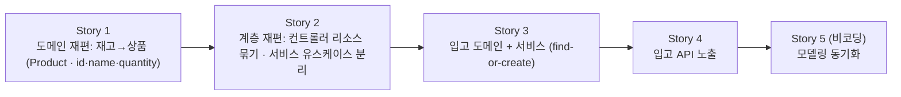

# 입고 처리 — Story 목록

선행: [../2-explore/explore-solutions.md](../2-explore/explore-solutions.md)

## 전체 흐름

입고는 빈 땅이 아니라 출고 에픽(Story 1~5) 위에 얹는다. 그래서 먼저 *바닥을 입고가 받을 수 있게 재편*하고(S1 도메인·S2 계층), 그 위에 입고를 출고가 닦은 결대로 도메인-퍼스트로 쌓는다(S3 도메인+서비스 → S4 API). 마지막에 모델링을 상품·입고 기준으로 동기화한다(S5, 구현 후 — 출고 에픽과 같은 패턴).

- **S1 도메인 재편** — 재고(`Stock`)를 상품(`Product {id, name, quantity}`)으로. 엔티티·식별자(`productId`→`id`)·`name`·영속·출고 코드/테스트를 상품으로 옮기되 출고는 그대로 동작. *(왜 먼저: 도메인 이름이 상품으로 굳어야 그 위 계층을 재편할 수 있다)*
- **S2 계층 재편** — 출고 전용 `ShipmentController`를 리소스로 묶은 상품 컨트롤러로, 서비스는 유스케이스별로 분리(`ShipService` 유지, 입고용 자리 확보). 입고가 합류할 계층을 미리 닦는다.
- **S3 입고 도메인 + 서비스** — 상품에 입고(수량 증가)·신규 등록을 더하고 `ReceiveService`가 find-or-create로 오케스트레이션. 단위·서비스 테스트.
- **S4 입고 API** — 입고 엔드포인트를 상품 컨트롤러에 추가, 요청/응답 DTO·검증·예외 매핑, 슬라이스 테스트 + 앱 띄워 확인.
- **S5 모델링 동기화 (비코딩)** — `structure`·`structure-ship`·`scenarios`를 상품·입고 기준으로 맞춤.

ADR 후보 배치 (한 Story 안에서도 ADR 단위로 하나씩 결정):

- **S1** — 재고→상품 통합 → [ADR-009](../../../adr/adr-009-product-stock-merged.md), 식별자 모델(productId 유지 + name) → [ADR-010](../../../adr/adr-010-product-identifier-model.md) *(결정)*
- **S2** — 컨트롤러·서비스 입자 규약 (백로그 결정 메모 승급)
- **S3** — 미등록 상품 판별 키 → ADR-010으로 함께 결정(`productId`)

## Story 1 — 도메인 재편: 재고(Stock) → 상품(Product)

### 목적

출고 에픽이 세운 재고(`Stock`) 도메인을 상품(`Product`)으로 재편한다. 과제 데이터 구조 `{id, name, quantity}`를 따라 상품이 수량을 직접 들고, `name`을 더한다. 출고 흐름(도메인·서비스·API·테스트)은 상품 기준으로 함께 옮겨 그대로 동작하게 한다. 입고는 아직 없다 — 이 Story는 바닥 어휘를 상품으로 굳히는 데까지다.

### 실행 완료 기준

- 재고(`Stock`) 도메인이 상품(`Product`)으로 바뀌고 `{id, name, quantity}`를 든다 (`name` 추가)
- 식별자 모델이 정해져 반영된다 (`productId` String 유지 vs 과제 `id` 채택 — ADR)
- 출고 코드(서비스·컨트롤러·DTO·리포지토리)와 테스트가 상품 기준으로 옮겨지고 그대로 통과한다 (출고 동작 불변)
- 영속(JPA 매핑·테이블)이 상품으로 갱신되고, 저장·조회가 동작한다

### ADR (결정)

- **재고→상품 통합** — 결정: 상품이 수량을 직접 드는 단일 애그리거트로 합친다 → [ADR-009](../../../adr/adr-009-product-stock-merged.md). ADR-004·005는 대상이 상품으로 바뀔 뿐 유지.
- **식별자 모델** — 결정: `productId`(String) 비즈니스 키 유지 + `name` 추가, 대리 `id`는 API 비노출 → [ADR-010](../../../adr/adr-010-product-identifier-model.md). 입고 미등록 판별 키(S3)도 `productId`로 함께 굳음.

## Story 2 — 계층 재편: 컨트롤러 리소스 묶기 · 서비스 유스케이스 분리

### 목적

출고 전용으로 선 웹·서비스 계층을, 입고가 합류할 수 있게 재편한다. 출고 전용 `ShipmentController`를 상품 리소스로 묶은 컨트롤러로 바꾸고, 서비스는 유스케이스별로 두는 규약을 세운다(`ShipService`는 출고 유스케이스로 유지). 미뤄둔 백로그 결정 메모(컨트롤러·서비스 입자 규약)를 여기서 ADR로 승급한다. 입고 기능은 아직 없다 — 계층 자리를 닦는 데까지다.

### 실행 완료 기준

- 컨트롤러가 상품 리소스로 묶인다 (`ShipmentController` → 상품 리소스 컨트롤러, 엔드포인트 경로 정리)
- 서비스를 유스케이스별로 두는 규약이 정해지고, `ShipService`가 그 규약대로 선다
- 출고 엔드포인트·동작은 그대로 (슬라이스 테스트 통과)
- 입자 규약이 ADR로 기록된다

### ADR 후보

- **컨트롤러·서비스 입자 규약** — 컨트롤러는 리소스로 묶고(상품 리소스 한 컨트롤러), 서비스는 유스케이스별로 분리해 god-service를 피한다. 백로그 결정 메모를 승급. *(컨트롤러 묶기의 값은 입고 엔드포인트가 합류하는 S4에서 온전히 드러난다 — S2는 그 자리를 미리 닦는다.)*

## Story 3 — 입고 도메인 + 서비스 (find-or-create)

### 목적

상품에 입고(수량 증가)와 신규 등록을 더하고, `ReceiveService`가 find-or-create로 오케스트레이션한다. 상품을 조회해 있으면 수량을 더하고, 없으면 `name`과 함께 새로 등록해 입고한다. 출고 에픽의 결대로 도메인-퍼스트 — 아직 웹은 없다.

### 실행 완료 기준

- 상품 도메인에 입고(수량 증가) 동작이 있고, 잘못된 입력(0·음수 수량)을 막는다 (불변식)
- 미등록 상품이면 `name`과 함께 신규 등록하는 경로가 있다 (find-or-create)
- `ReceiveService`가 조회 → 있으면 증가·없으면 등록·생성 → 저장을 한 트랜잭션 경계에서 돈다
- 단위(도메인)·서비스 테스트로 입고 신규·기존 흐름을 검증한다

### ADR (결정)

- **미등록 상품 판별 키** — 결정: `productId`로 "이미 있음"을 가른다. S1 식별자 모델과 한 몸으로 [ADR-010](../../../adr/adr-010-product-identifier-model.md)에서 굳음.

## Story 4 — 입고 API 노출

### 목적

S2에서 묶은 상품 컨트롤러에 입고 엔드포인트를 더한다. 입고 요청을 HTTP로 받아 `ReceiveService`를 태우고, 등록/증가 후 수량을 응답한다. 잘못된 요청은 적절한 에러로 거부한다.

### 실행 완료 기준

- 입고 REST 엔드포인트가 요청을 받아 서비스를 태우고 결과(등록/증가 후 수량)를 응답한다
- 잘못된 요청(0·음수 수량, 신규인데 `name` 누락 등)에 적절한 에러 응답을 반환한다 (400)
- `@WebMvcTest` 슬라이스 테스트로 신규·기존·에러를 검증한다 (출고 에픽 [ADR-008](../../../adr/adr-008-api-test-webmvc-slice.md) 따름)
- 앱을 띄워 실제 HTTP로 입고 흐름(신규 등록·기존 증가·400)을 확인한다

### Task 안에서 정할 것

- 신규 등록과 기존 증가를 HTTP 의미로 가를지(201 Created vs 200 OK) 또는 둘 다 200으로 둘지
- 입고 요청 DTO 모양(`name`을 신규에만 받을지, 항상 받을지)

*(API 테스트·검증·예외 매핑은 출고 에픽 패턴을 재사용 — 새 ADR 없음.)*

## Story 5 — 모델링 동기화 (비코딩)

### 목적

구현(S1~S4)으로 굳은 상품·입고를 모델링에 되먹인다. 재고→상품 통합과 입고 흐름을 `structure`·`structure-ship`·`scenarios`에 반영한다. 출고 에픽 Story 5와 같은 패턴 — 구현 후 동기화, 문서만 손댄다.

### 실행 완료 기준

- `structure.md`가 상품·재고 통합(상품이 수량을 직접 듦)을 반영한다 — 기존 상품·재고·이력 분리에서 갱신
- `structure-ship.md`가 상품·입고를 포함하도록 갱신된다 (이름·범위 재고려 포함 — 출고 전용 문서가 상품 리소스 전체로 넓어질지)
- 입고 처리 시나리오가 `scenarios`에 적정 추상 수준으로 더해진다
- 출고 시나리오·구조의 재고→상품 어휘가 정합된다
- 시스템 전체 비전은 적정 범위로 유지한다

### 분해

비코딩 Story라 plan-tasks를 건너뛰고 바로 execute-task로 실행한다.
