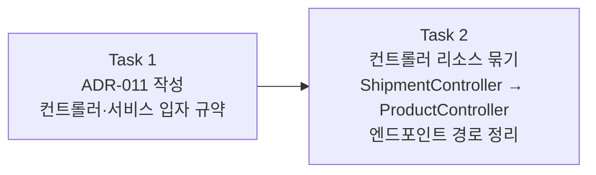

# Story 2 — Task 목록

선행: [../stories.md](../stories.md) §Story 2

## 전체 흐름

결정 먼저, 코드 나중. 백로그 결정 메모(컨트롤러는 리소스로 묶고, 서비스는 유스케이스별로)가 이미 굳어 있으니, Task 1에서 ADR로 공식화하고, Task 2에서 그 규약대로 코드를 옮긴다.

---

## Task 1 — ADR-011 작성: 컨트롤러·서비스 입자 규약

### 목표

백로그 결정 메모(컨트롤러·서비스 입자 규약)를 ADR-011로 승급한다. 입고가 합류하는 지금이 "두 번째 기능"이라는 ADR 트리거 조건이 충족된 시점이다. 코드 변경 없이 문서만.

### 핵심 작업

- `docs/adr/adr-011-controller-service-granularity.md` 작성
  - 결정: 컨트롤러는 리소스 단위로 묶는다 (`ProductController`가 `/api/products/*` 전체 담당)
  - 결정: 서비스는 유스케이스 단위로 분리한다 (`ShipService`, `ReceiveService` 등 — god-service 금지)
  - 트리거: 입고(두 번째 기능)가 합류해 잠정 방향이 구체 케이스 둘로 검증된 시점
  - 대안과 기각 이유

### 이 Task에서 하지 않을 것

- 코드 변경 — Task 2

### 완료 기준

- ADR-011 문서가 결정·배경·대안을 담아 작성된 상태

---

## Task 2 — 컨트롤러 리소스 묶기

### 목표

출고 전용으로 선 `ShipmentController`를 상품 리소스 컨트롤러로 재편한다. ADR-011 규약대로 컨트롤러 이름·경로를 상품 기준으로 맞추고, 서비스는 `ShipService`가 유스케이스 단위로 서 있음을 확인한다. 출고 동작은 불변.

### 핵심 작업

- `ShipmentController` → `ProductController` 리네임
- 엔드포인트 경로 정리: `/api/stock/shipment` → `/api/products/shipments`
- `ShipmentControllerTest` → `ProductControllerTest` + 경로 갱신
- `ShipService`가 유스케이스 단위 규약대로 서 있음을 확인 (코드 변경 불필요시 확인으로 갈음)

### 이 Task에서 하지 않을 것

- 입고 엔드포인트 추가 — S4
- `ShipmentRequest`·`ShipmentResponse` DTO 이름 변경 — 출고 의미가 명확하므로 유지
- 서비스 내부 로직 변경

### 완료 기준

- `ProductController`가 `/api/products/shipments`로 출고 요청을 받는 상태
- 출고 동작·응답 코드(200/409)가 불변인 상태
- `ProductControllerTest`가 통과하는 상태

---

## 다음 사이클

S2가 닫히면 상품 리소스 컨트롤러와 유스케이스 서비스 규약이 선다. S3(입고 도메인 + 서비스)의 plan-tasks로 진입한다.
