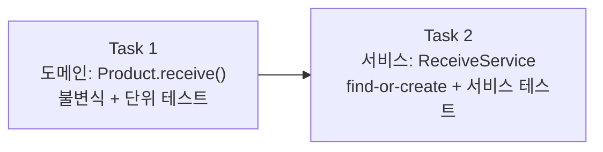

# Story 3 — Task 목록

선행: [../stories.md](../stories.md) §Story 3

## 전체 흐름

도메인 먼저, 서비스 나중. `Product.receive()`가 굳어야 `ReceiveService`가 그것을 태울 수 있다. 출고 에픽(도메인 → 서비스) 패턴과 같다.

---

## Task 1 — 도메인: Product.receive()

### 목표

`Product`에 입고(수량 증가) 동작을 더한다. 잘못된 입력(0·음수 수량)은 불변식으로 막는다. 서비스·API는 아직 없다 — 도메인 동작만.

### 핵심 작업

- `Product.receive(int quantity)` 메서드 추가 — 수량 증가, 0·음수 거부
- 도메인 단위 테스트 (`ReceiveTest`) — 정상 증가·0 수량·음수 수량 케이스

### 이 Task에서 하지 않을 것

- `ReceiveService` — Task 2
- 신규 상품 등록(find-or-create) — Task 2
- 입고 API 노출 — S4

### 완료 기준

- `Product.receive()`가 수량을 증가시키는 상태
- 0·음수 수량이 `IllegalArgumentException`으로 거부되는 상태
- 도메인 단위 테스트가 통과하는 상태

---

## Task 2 — 서비스: ReceiveService (find-or-create)

### 목표

`ReceiveService`가 find-or-create로 입고를 오케스트레이션한다. `productId`로 상품을 조회해 있으면 수량을 더하고, 없으면 `name`과 함께 새로 등록해 입고한다. 한 트랜잭션 안에서 완결.

### 핵심 작업

- `ReceiveCommand(productId, name, quantity)` 레코드 추가
- `ReceiveResult(quantity)` 레코드 추가 — 입고 후 현재 수량
- `ReceiveService.receive(ReceiveCommand)` 구현
  - 기존 상품: `productId`로 조회 → `receive(quantity)` → 저장
  - 신규 상품: `new Product(productId, name, 0)` → `receive(quantity)` → 저장
- 서비스 목 단위 테스트 (`ReceiveServiceTest`) — 기존 상품 입고·신규 상품 등록 케이스 (ADR-007 패턴)

### 이 Task에서 하지 않을 것

- 입고 API 노출 — S4
- `name` 검증(null·blank) — API 경계에서 처리 (S4)

### 완료 기준

- `ReceiveService`가 기존 상품의 수량을 증가시키는 상태
- `ReceiveService`가 미등록 상품을 `name`과 함께 신규 등록하는 상태
- 서비스 목 단위 테스트가 통과하는 상태

---

## 다음 사이클

S3이 닫히면 입고 도메인·서비스가 선다. S4(입고 API 노출) plan-tasks로 진입한다.
