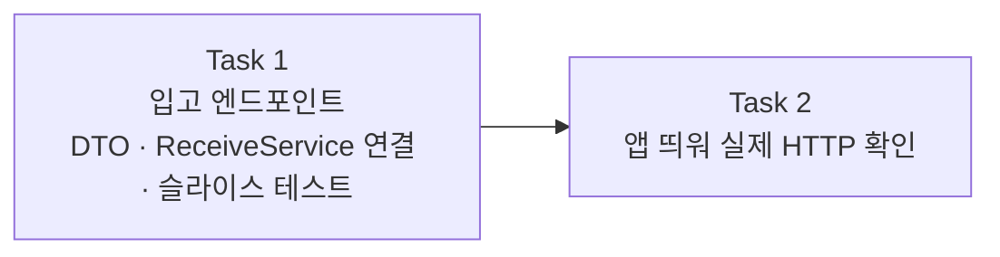

# Story 4 — Task 목록

선행: [../stories.md](../stories.md) §Story 4

## 전체 흐름

API 노출 먼저, 수동 검증 나중. Task 1에서 엔드포인트·검증·예외 매핑을 코드로 완성하고, Task 2에서 앱을 실제로 띄워 end-to-end를 확인한다.

---

## Task 1 — 입고 엔드포인트

### 목표

`ProductController`에 입고 엔드포인트를 추가한다. 입고 요청을 HTTP로 받아 `ReceiveService`를 태우고, 결과(입고 후 수량)를 응답한다. 잘못된 요청은 400으로 거부한다.

### Task 안에서 정할 것

- **응답 코드** — 신규 등록(201 Created) vs 기존 증가(200 OK)로 가를지, 둘 다 200으로 둘지
- **DTO 모양** — `name`을 항상 받을지(`name` 없으면 400), 신규에만 선택적으로 받을지

### 핵심 작업

- `ReceiveRequest` DTO 추가 (Bean Validation 포함)
- `ReceiveResponse` DTO 추가
- `ProductController`에 입고 엔드포인트 추가 (`POST /api/products/receive`)
- `ApiExceptionHandler`에 입고 관련 예외 매핑 확인 (추가 필요 시)
- `ProductReceiveControllerTest` 작성 — ADR-011 테스트 규약 (신규·기존·에러 케이스, ADR-008 슬라이스 패턴)

### 이 Task에서 하지 않을 것

- 앱 실행·수동 HTTP 확인 — Task 2

### 완료 기준

- 입고 엔드포인트가 `ReceiveService`를 태우고 수량을 응답하는 상태
- 잘못된 요청(0·음수 수량, `name` 누락 등)이 400으로 거부되는 상태
- `ProductReceiveControllerTest`가 통과하는 상태

---

## Task 2 — 앱 띄워 실제 HTTP 확인

### 목표

앱을 띄워 실제 HTTP로 입고 흐름 전 구간을 확인한다. 슬라이스 테스트가 잡지 못하는 컨트롤러→서비스→도메인→DB 연결을 검증한다. 출고 에픽 S4 패턴과 같다.

### 핵심 작업

- Docker PostgreSQL 기동 (`make db-up`)
- 앱 실행
- 실제 HTTP 요청으로 확인: 신규 상품 등록·기존 상품 증가·400 에러

### 이 Task에서 하지 않을 것

- 코드 변경 — Task 1에서 완결. 이 Task는 확인만.

### 완료 기준

- 신규 상품 입고 HTTP 요청이 성공 응답을 돌려주는 상태
- 기존 상품 입고 HTTP 요청이 증가된 수량을 돌려주는 상태
- 잘못된 요청이 400을 돌려주는 상태

---

## 다음 사이클

S4가 닫히면 입고 API가 완성된다. S5(모델링 동기화, 비코딩)는 plan-tasks 없이 바로 execute-task로 진입한다.
