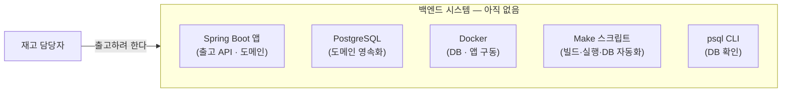

# 문제 정의 — 출고 처리 (AS-IS)

## 흐름 설명

재고 담당자가 출고하려 해도, 그 요청을 받아 처리할 백엔드 시스템이 아직 없다. 출고 흐름은 scenarios·structure에 정의돼 있지만 그 정의를 실행할 토대가 통째로 비어 있다 — 출고 API와 도메인을 담을 Spring Boot 앱, 도메인을 영속화할 PostgreSQL, 이들을 구동할 Docker, 빌드·실행·DB 작업을 묶을 Make 자동화, DB 상태를 확인할 psql CLI 어느 것도 서 있지 않다.

이 에픽이 닫을 격차는 *이 백엔드 토대를 세우고, 그 위에서 출고가 실제로 동작하게 하는 것*이다.

## 컴포넌트 설명

- **재고 담당자** — 출고를 일으키려는 주체. 지금은 출고를 맡길 시스템이 없다.
- **Spring Boot 앱** — 출고 API와 도메인(상품·재고)을 담을 실행체. 미생성.
- **PostgreSQL** — 도메인(상품·재고)을 영속화할 DB. 미설정.
- **Docker** — DB·앱을 구동할 컨테이너 환경. 미구성.
- **Make 스크립트** — 빌드·실행·DB 초기화 등을 한 명령으로 묶는 자동화. 미작성.
- **psql CLI** — DB 상태를 직접 확인하는 클라이언트. 미설정.
