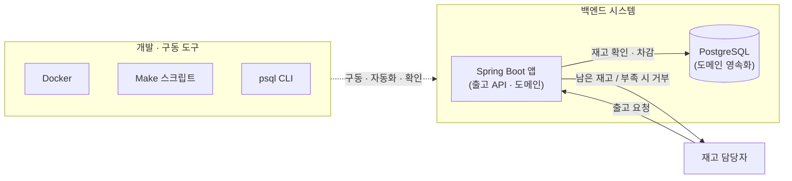

# 해결 방향 — 출고 처리 (TO-BE)

## 흐름 설명

AS-IS에서 통째로 비어 있던 백엔드 시스템이 서고, 그 위에서 출고 흐름이 실제로 돈다. 재고 담당자가 출고를 요청하면 Spring Boot 앱의 출고 API가 받아, 현재 재고를 확인하고 충분하면 차감해 PostgreSQL에 영속화한 뒤 남은 재고를 응답한다. 부족하면 재고를 건드리지 않고 거부한다. Docker가 DB·앱을 컨테이너로 구동하고, Make가 빌드·실행·DB 초기화를 한 명령으로 묶고, psql로 DB 상태를 확인한다.

## 컴포넌트 설명

- **재고 담당자** — 출고 API를 호출하는 클라이언트. AS-IS에선 출고를 맡길 시스템이 없었지만, TO-BE에선 출고 API로 요청을 보내고 남은 재고(성공)나 부족 거부 응답을 받는다.
- **Spring Boot 앱** — 출고 API와 도메인(상품·재고)을 담는 실행체. 출고 요청을 받아 현재 재고를 확인하고, 충분하면 차감해 남은 재고를 응답하고 부족하면 거부한다. AS-IS에선 미생성이었으나 TO-BE에서 출고 흐름의 중심에 선다.
- **PostgreSQL** — 도메인(상품·재고)을 영속화하는 DB. 출고로 줄어든 재고가 여기 반영된다. AS-IS에선 미설정이었으나 TO-BE에서 도메인이 실제로 저장되는 곳이 된다.
- **Docker** — DB·앱을 컨테이너로 구동하는 환경. 로컬에서 PostgreSQL과 앱을 일관되게 띄운다.
- **Make 스크립트** — 빌드·실행·DB 초기화 같은 반복 작업을 한 명령으로 묶는 자동화.
- **psql CLI** — DB 상태를 직접 확인하는 클라이언트. 출고가 재고에 제대로 반영됐는지 들여다본다.

## 미결정

내부 설계 결정들. 대안을 놓고 고르는 ADR감이라 다이어그램에는 넣지 않고 여기 모은다.

- **구현 아키텍처** — 레이어드 vs 헥사고날
- **영속 기술** — JPA 확정 (MyBatis 제외)
- **재고 저장 모델** — 수량 컬럼 vs 변동 이력 합산
- **단위테스트 전략** — Given/When/Then 구조, Fixture 패턴
- **동시성 제어 기법** — 주로 *동시 재고 변경 충돌* 에픽에서 다룬다. 출고 happy-path는 단일 요청 기준으로 세우고, 동시성은 그 에픽에서 이 흐름 위에 얹는다.
