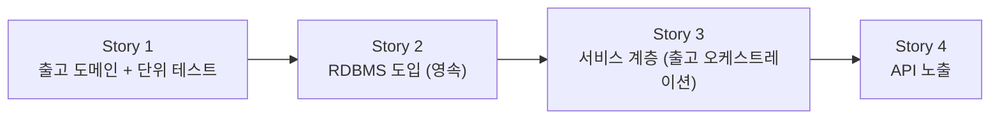

# 출고 처리 — Story 목록

선행: [../2-explore/explore-solutions.md](../2-explore/explore-solutions.md)

## 전체 흐름

도메인-퍼스트로 간다. 출고의 핵심 로직(재고 차감·음수 불가)을 DB·웹 없이 순수 도메인 + 단위 테스트로 먼저 못 박고(S1), 그 위에 RDBMS를 도입해 영속한다(S2). 그 위에 서비스 계층이 출고를 엮고(재고 조회 → 차감 → 저장, S3), REST API로 노출한다(S4). 레이어드(도메인 → 영속 → 서비스 → API)로 한 겹씩 쌓는다. 동시성은 이 흐름이 선 뒤 *동시 재고 변경 충돌* 에픽에서 RDBMS 위에 얹는다.

ADR 후보 배치 (한 Story 안에서도 ADR 단위로 하나씩 결정):

- **Story 1** — 구현 아키텍처(레이어드 vs 헥사고날), FP(ADT) 도입 여부, 단위테스트 전략(Given/When/Then·Fixture)
- **Story 2** — 도메인 엔티티와 JPA 엔티티 분리 여부, 재고 저장 모델(수량 컬럼 vs 변동 이력 합산)
- **Story 3** — 서비스 테스트 방식 (repository 목 단위테스트 vs 영속까지 묶은 통합)
- **Story 4** — API 계층 테스트 방식 (컨트롤러 단위테스트 vs 통합테스트)

## Story 1 — 출고 도메인 + 단위 테스트

### 목적

출고의 핵심 도메인 로직을 순수 객체로 세우고 단위 테스트로 검증한다 — 재고 차감, 재고 부족 시 거부(음수 불가). DB·웹 없이 in-memory로, 가장 빠른 피드백 루프에서 알맹이를 못 박는다.

### 실행 완료 기준

- 상품·재고 도메인과 출고 로직(충분하면 차감, 부족하면 거부)이 순수 객체로 존재한다
- 단위 테스트로 정상 출고·부족 거부·경계(정확히 0까지 출고)를 검증해 통과한다
- DB·웹 의존이 없다 (in-memory)

### ADR 후보

- **구현 아키텍처** — 결정: 레이어드 기반 + 헥사고날 요소 일부 → [ADR-001](../../../adr/adr-001-layered-with-hexagonal.md)
- **FP(ADT) 도입 여부** — 결정: 도입 안 함 (재고 상태가 ADT를 정당화할 만큼 풍부하지 않음) → [ADR-002](../../../adr/adr-002-no-adt.md)
- **단위테스트 전략** — 결정: JUnit5/AssertJ · Given/When/Then · Test Data Builder → [ADR-003](../../../adr/adr-003-test-strategy.md)

## Story 2 — RDBMS 도입 (영속)

### 목적

Story 1의 출고 도메인 로직을 유지한 채, 그 위에 JPA 매핑과 영속 계층을 더해 PostgreSQL에 저장한다. DB를 띄울 실행 환경(Docker로 PostgreSQL 구동, Make로 빌드·실행·DB 초기화 자동화, psql로 확인)도 여기서 선다.

### 실행 완료 기준

- PostgreSQL이 Docker로 뜨고, Make 한 명령으로 빌드·실행·DB 초기화가 된다
- 재고(Stock) 도메인이 PostgreSQL에 저장·조회된다 (영속 계층)
- Story 1의 도메인 단위 테스트는 그대로 통과한다 (도메인 동작 불변 — JPA 매핑은 더해지되 로직은 안 바뀜)
- 저장 후 조회로 영속이 동작함을 확인한다

### ADR 후보

- **도메인 엔티티와 JPA 엔티티 분리 여부** — 결정: 하나로(도메인에 직접 JPA 매핑) + 공통 컬럼 규약(BaseEntity: createdAt·updatedAt·version)·낙관락 → [ADR-004](../../../adr/adr-004-jpa-entity-merged.md)
- **재고 저장 모델** — 결정: 수량 컬럼 → [ADR-005](../../../adr/adr-005-stock-quantity-column.md)
- **영속 계층 단위테스트 추가 여부** — 결정: 둔다(@DataJpaTest 슬라이스) → [ADR-006](../../../adr/adr-006-persistence-test.md)

## Story 3 — 서비스 계층 (출고 오케스트레이션)

### 목적

Story 1 도메인과 Story 2 영속 사이를 잇는 서비스 계층을 세운다. 출고 요청(productId·수량)을 받아 재고를 조회하고, 도메인 `ship`을 태운 뒤 결과를 저장한다 — 조회부터 저장까지가 한 트랜잭션 안에서 원자적으로 돈다. 서비스는 도메인 결과(남은 재고/부족)를 호출자(다음 Story의 API)에게 돌려준다. 아직 웹은 없다.

### 실행 완료 기준

- 출고 서비스가 productId·수량을 받아 재고를 조회 → 차감 → 저장하고 결과(남은 재고/부족)를 돌려준다
- 재고 부족 시 저장하지 않고 부족을 알린다
- 조회부터 저장까지가 한 트랜잭션 경계 안에서 동작한다
- 서비스 테스트로 출고 성공·부족 흐름을 검증한다

### ADR 후보

- **서비스 테스트 방식** — repository를 목으로 둔 단위테스트 vs 영속까지 묶은 통합테스트

## Story 4 — API 노출

### 목적

Story 3 서비스 위에 출고 REST API를 노출한다. 출고 요청을 HTTP로 받아 서비스를 태우고, 남은 재고나 부족 거부를 적절한 HTTP 응답·에러로 돌려준다.

### 실행 완료 기준

- 출고 REST 엔드포인트가 요청을 받아 서비스를 태우고 남은 재고를 응답한다
- 재고 부족 시 적절한 에러 응답으로 거부한다 (음수 불가)
- 잘못된 요청에 적절한 에러 응답을 반환한다
- 앱을 띄워 실제 HTTP 요청으로 출고 흐름이 동작함을 확인한다

### ADR 후보

- **API 계층 테스트 방식** — 컨트롤러 단위테스트(슬라이스) vs 통합테스트
