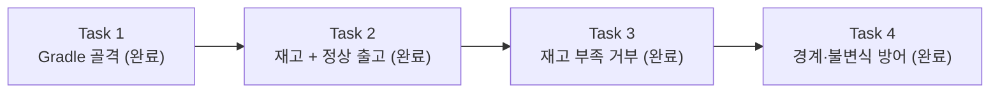

# Story 1 — Task 목록

선행: [../stories.md](../stories.md) §Story 1

## 전체 흐름

도메인 코드가 올라설 빌드 바닥을 먼저 세우고(T1), 그 위에 출고 도메인을 *동작 증분*으로 한 조각씩 올린다 — 충분할 때 차감하는 정상 출고(T2), 부족할 때 거부(T3), 그리고 경계·불변식 방어(T4). 골격은 별개의 검토 관심사라 분리하고, 출고 도메인은 한 덩어리로 올리지 않고 각 동작을 작은 PR이자 검토 체크포인트로 나눈다. 각 조각은 그 동작과 그것을 증명하는 테스트를 함께 든다.

---

## Task 1 — Gradle 프로젝트 골격 ✅ 완료

실행 기록: [task1-executed.md](task1-executed.md)

### 목표

도메인 코드와 단위 테스트가 컴파일·실행되는 빌드 토대를 세운다. 이 Task가 끝나면 빈 테스트 하나가 `./gradlew test`로 실제로 돈다.

### 핵심 작업

- Gradle 프로젝트 초기화 (Gradle Wrapper 포함)
- 테스트 의존성: JUnit 5 + AssertJ (ADR-003)
- 패키지 구조: 도메인이 영속·웹과 섞이지 않게 분리된 베이스 패키지 (ADR-001 — 레이어드 용어 + 영속 경계 의존 역전)
- 골격이 도는지 확인할 샘플 테스트 1개

**Task 안의 결정 — 빌드 베이스:** **Java 21 + Spring Boot 3.x** (과제는 버전 미지정 — 가장 널리 깔린 LTS·생태계 성숙으로 제출물 호환성 우선). Spring Boot 베이스로 깔되, Story 1 소스는 도메인·테스트만 둔다. Story 2(DB)·Story 3(웹)에서 같은 골격 위에 스타터를 얹게 되므로 처음부터 Spring Boot 베이스가 자연스럽다. 단 Story 1에서는 웹·DB 스타터를 추가하지 않는다. 정확한 패치 버전(Spring Boot 3.5.x 등)은 execute-task에서 build.gradle 작성 시 최신 안정판으로 확정한다.

### 이 Task에서 하지 않을 것

- 출고/재고 도메인 로직 (Task 2)
- 웹·DB 의존성, Docker, Make 자동화 (Story 2·3)
- repository 인터페이스 등 영속 경계 (Story 2)

### 완료 기준

- `./gradlew build`가 성공한 상태
- 샘플 테스트가 `./gradlew test`로 통과한 상태
- 도메인 코드가 들어갈 패키지가 영속·웹과 분리돼 잡힌 상태

---

## Task 2 — 재고 + 정상 출고 ✅ 완료

실행 기록: [task2-executed.md](task2-executed.md)

### 목표

재고를 순수 객체로 세우고, 재고가 충분할 때 출고 수량만큼 차감되게 한다. 정상 출고 하나를 테스트로 증명한다. 출고 도메인의 가장 작은 알맹이.

### 핵심 작업

- 재고(Stock) 순수 객체 — 어떤 상품의 재고인지 + 현재 수량 (ADT 없이 단순 수량 값, ADR-002)
- 출고: 재고가 충분하면 출고 수량만큼 차감하고 남은 재고를 확인할 수 있게
- 정상 출고 테스트 하나 — Given/When/Then, Test Data Builder (ADR-003)

### 이 Task에서 하지 않을 것

- 재고 부족 거부 분기 (Task 3)
- 경계·불변식·입력 검증 (Task 4)
- 영속·웹·동시성·변동 이력 (Story 2·3 / 별도 에픽)
- 출고 결과 표현 방식 확정 — 부족 분기가 생기는 Task 3에서 함께 정한다

### 완료 기준

- 재고가 충분할 때 출고로 수량이 차감되고 남은 재고가 확인되는 상태
- 정상 출고가 단위 테스트로 통과한 상태
- DB·웹 의존이 없는 상태 (in-memory)

---

## Task 3 — 재고 부족 거부 ✅ 완료

실행 기록: [task3-executed.md](task3-executed.md)

### 목표

재고가 부족하면 출고를 거부하고 재고를 건드리지 않는다. 재고 부족은 예외가 아닌 정상 분기다.

### 핵심 작업

- 부족 분기 추가 — 재고보다 많이 요청하면 차감하지 않고 거부
- **출고 결과 표현 결정** — 성공(남은 재고)과 부족을 어떻게 돌려줄지 이 조각에서 합의 (단순 값, ADT 없이 — ADR-002)
- 부족 거부 테스트 하나

### 이 Task에서 하지 않을 것

- 경계(정확히 0까지)·불변식·입력 검증 (Task 4)
- 영속·웹·동시성·변동 이력

### 완료 기준

- 재고 부족 시 출고가 거부되고 재고가 그대로인 상태
- 부족 거부가 단위 테스트로 통과한 상태
- 출고 결과를 어떻게 돌려줄지 표현 방식이 정해진 상태

---

## Task 4 — 경계·불변식 방어 ✅ 완료

실행 기록: [task4-executed.md](task4-executed.md)

### 목표

출고의 경계와 재고 불변식을 못박는다 — 정확히 0까지 출고, 재고 수량 0 미만 불가, 비정상 출고 수량 거부.

### 핵심 작업

- 경계: 재고와 같은 수량 출고 → 정확히 0까지 차감 + 테스트
- 불변식: 재고 수량 ≥ 0 (생성 시 음수 거부) + 테스트
- 입력 검증: 비정상 출고 수량(0·음수) 거부 + 테스트 — 부족(정상 분기)과 구분되는 방어

### 이 Task에서 하지 않을 것

- 영속·웹·동시성·변동 이력
- 잘못된 요청에 대한 HTTP 에러 응답 (Story 3)

### 완료 기준

- 경계(정확히 0까지)·불변식(수량 ≥ 0)·입력 검증이 단위 테스트로 통과한 상태
- Story 1 닫힘 기준(정상 출고·부족 거부·경계)이 모두 충족된 상태

---

## 다음 사이클

Task 2 → 3 → 4 순으로 execute-task로 실행하되, 각 Task를 한 덩어리로 끝내지 않고 작은 단위로 핑퐁한다. Story 1이 닫히면 Story 2(RDBMS 도입)의 plan-tasks는 *그 Story 진입 직전*에 별도 사이클로 — 여기서 미리 짜지 않는다.
