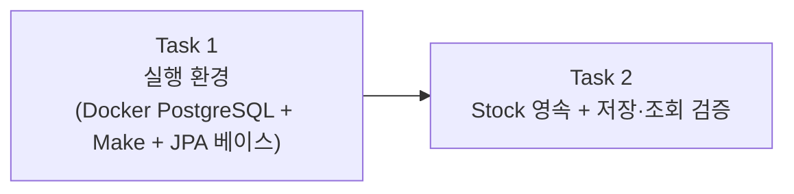

# Story 2 — Task 목록

선행: [../stories.md](../stories.md) §Story 2

## 전체 흐름

먼저 DB가 뜨고 앱이 거기 붙는 실행 환경을 만들고(T1), 그 위에 Stock을 저장하고 다시 읽는 영속 계층을 올린다(T2). 두 작업은 리뷰할 때 보는 게 다르다 — T1은 실행 환경(Docker·Make·datasource·JPA 의존성)이라 "앱이 DB에 붙고 한 명령으로 뜨는가"를 보고, T2는 저장 코드(엔티티 매핑·repository·테스트)라 "Stock이 실제로 저장되고 다시 읽히는가"를 본다. 매핑은 repository·`@DataJpaTest`와 한 PR로 묶었다 — 매핑만 올리고 저장·조회 테스트가 없으면 제대로 도는지 확인할 수 없기 때문이다(Story 1에서도 기능과 그 기능을 확인하는 테스트를 늘 같이 넣었다). Story가 하루 정도 크기라 Task 두 개면 알맞다.

저장할 도메인은 **`Stock` 하나**다. Story 1에서 `Product`를 따로 만들지 않고 상품을 가리키는 값을 `productId`(String)로 두었기 때문에, 상품은 stock 테이블의 한 컬럼일 뿐 따로 저장하는 엔티티가 아니다.

---

## Task 1 — 실행 환경 (Docker PostgreSQL + Make + JPA 베이스)

### 목표

PostgreSQL을 Docker로 띄우고, Make 한 명령으로 빌드·실행할 수 있게 한다. 앱에 JPA·PostgreSQL 의존성과 datasource 설정을 더해, 앱이 떠서 DB에 붙는 바닥을 만든다. 스키마는 `ddl-auto`로 앱이 뜰 때 자동으로 만들어지게 둔다(만들 테이블 내용은 Task 2의 엔티티에서 나온다).

### 핵심 작업

- docker-compose에 PostgreSQL 정의 — 포트·계정·DB 이름
- Makefile — `build`(빌드), `db-up`/`db-down`(DB 띄우고 내리기), `run`(앱 실행)
- 의존성 추가 — `spring-boot-starter-data-jpa`, PostgreSQL 드라이버
- `application.yml` — datasource(url·계정), JPA(`ddl-auto`, dialect 등)

### 이 Task에서 하지 않을 것

- 엔티티 매핑·repository·저장 코드 (Task 2)
- `@DataJpaTest` 등 영속 테스트 (Task 2)
- BaseEntity·공통 컬럼(createdAt·updatedAt·version)·낙관락 (Task 2)
- API·충돌 처리·동시성

### 완료 기준

- PostgreSQL이 Docker로 떠 있는 상태
- Make 한 명령으로 빌드·실행이 되는 상태
- 앱이 떠서 PostgreSQL에 붙는 상태(datasource가 정상으로 연결됨)

---

## Task 2 — Stock 영속 + 저장·조회 검증

### 목표

Stock을 PostgreSQL에 저장하고 다시 읽을 수 있게 한다. 모든 엔티티가 공통으로 가질 컬럼(createdAt·updatedAt·version)을 BaseEntity로 묶어 Stock에 입히고, `@DataJpaTest`로 저장·조회가 실제로 도는지 확인한다.

### 핵심 작업

- BaseEntity(`@MappedSuperclass`) — `createdAt`·`updatedAt`(JPA Auditing), `version`(`@Version`). Auditing 켜기.
- Stock에 JPA 매핑 — `@Entity`, 식별자, 수량·productId 컬럼. BaseEntity 상속.
- StockRepository — Spring Data JPA
- `@DataJpaTest` — Stock 저장 후 다시 읽어 값이 맞는지, 공통 컬럼·version이 채워졌는지 확인

### Task 안에서 정할 것

- **식별자 전략** — Stock의 기본키를 자동 증가 값으로 둘지, productId를 키로 쓸지
- **JPA용 기본 생성자** — `@Entity`라 no-arg 생성자가 필요하다. 외부에서 못 쓰게 접근을 닫아 둔다(Story 1 Task 4에서 미뤄 둔 결정을 여기서 처리)
- **테스트 DB** — Testcontainers(PostgreSQL 그대로) / H2(가벼움) 중 무엇으로 `@DataJpaTest`를 돌릴지 (ADR-006 메모)

### 이 Task에서 하지 않을 것

- API (Story 3)
- 충돌 처리·동시성 테스트 — `@Version` 컬럼과 JPA 기본 강제까지만, 충돌을 어떻게 다룰지는 별도 에픽
- Product 별도 엔티티 — 상품은 stock 테이블의 컬럼
- 변동 이력 — 수량 컬럼 하나만(ADR-005)

### 완료 기준

- Stock이 PostgreSQL에 저장되고 다시 읽히는 상태
- 공통 컬럼(createdAt·updatedAt)과 version이 채워지는 상태
- Story 1 도메인 단위 테스트가 그대로 통과하는 상태(동작은 안 바뀜)
- `@DataJpaTest` 저장·조회 검증이 통과하는 상태

---

## 다음 사이클

Task 1 → 2 순서로 execute-task로 실행한다. Story 3(API 노출)의 plan-tasks는 그 Story를 시작하기 바로 전에 따로 짠다 — 여기서 미리 짜두지 않는다.
