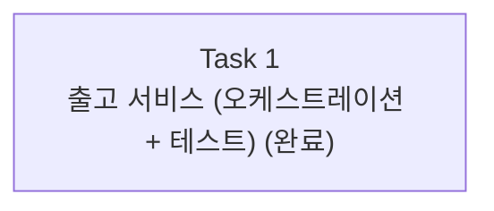

# Story 3 — Task 목록

선행: [../stories.md](../stories.md) §Story 3

## 전체 흐름

Story 3은 작다 — 서비스 클래스 하나, repository 조회 메서드 하나, 서비스 테스트가 한 덩어리로 묶인다. 억지로 쪼개면 "repository 메서드만 있는" 증명 못 할 조각이 생기므로 Task 하나(1:1)로 둔다.

---

## Task 1 — 출고 서비스 (오케스트레이션 + 테스트) ✅ 완료

실행 기록: [task1-executed.md](task1-executed.md)

### 목표

productId·수량을 받아 재고를 조회 → 도메인 `ship` → 저장하고, 결과(남은 재고/부족)를 호출자에게 돌려주는 출고 서비스를 세운다. 조회부터 저장까지가 한 트랜잭션 안에서 돈다. repository를 목으로 둔 단위테스트로 성공·부족 흐름을 확인한다(ADR-007).

### 핵심 작업

- `StockRepository.findByProductId(String)` 추가 — 재고를 productId로 조회
- `Stock`에 `product_id` 인덱스 — `@Table(indexes = @Index(...))`로 선언(조회가 풀 스캔 안 되게). ddl-auto가 인덱스를 만든다 — schema.sql로 가지 않고 어노테이션으로 둔다(테스트 H2 설정 유지)
- 출고 서비스(`@Service`, `@Transactional`) — 조회 → `stock.ship(quantity)` → 결과별 처리(성공이면 저장·남은 재고, 부족이면 저장 안 함)
- 서비스 테스트 — repository 목으로 성공·부족 검증(부족이면 `save`가 호출되지 않음 포함)

### Task 안에서 정할 것

- **서비스 결과 표현** — 성공(남은 재고)과 부족을 호출자에게 어떻게 돌려줄지 (작은 record로 묶을지, `ShipmentResult`에 남은 재고를 함께 실을지)
- **상품 없음 처리** — productId로 재고를 못 찾을 때(예외 vs 다른 결과). Story 4에서 HTTP로 매핑될 분기다
- **저장 방식** — `@Transactional` 더티체킹에 맡길지, 명시적으로 `save()`를 부를지

### 이 Task에서 하지 않을 것

- 웹·컨트롤러·요청/응답 DTO·HTTP 응답 (Story 4)
- 통합테스트 — repository 목 단위테스트로 간다 (ADR-007)
- 동시성 충돌 처리 — `@Version` 컬럼·JPA 기본 강제까지만, 충돌 처리는 별도 에픽

### 완료 기준

- 서비스가 productId·수량으로 재고를 조회 → 차감 → 저장하고 결과(남은 재고/부족)를 돌려주는 상태
- 재고 부족 시 저장하지 않고 부족을 알리는 상태
- 조회부터 저장까지가 한 트랜잭션 경계 안에서 도는 상태
- repository 목 단위테스트로 성공·부족 흐름이 통과하는 상태

---

## 다음 사이클

Task 1을 execute-task로 실행한다. Story 4(API 노출)의 plan-tasks는 그 Story를 시작하기 바로 전에 따로 짠다 — 여기서 미리 짜두지 않는다.
