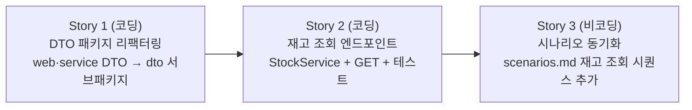

# 재고 조회 — Story 목록

선행: [../../modeling/scenarios.md](../../modeling/scenarios.md)

## 전체 흐름

DTO 구조 먼저 정리한 뒤 새 엔드포인트를 깔끔한 구조 위에 얹는다.

---

## Story 1 — DTO 패키지 리팩터링

### 목적

서비스·컨트롤러가 3개가 되는 시점에 맞춰, 현재 각 레이어 패키지에 흩어져 있는 DTO를 `dto` 서브패키지로 옮긴다. 3의 법칙 — 같은 패턴이 세 번 반복되면 구조를 명시한다.

이동 대상:
- `web`: `ReceiveRequest`, `ReceiveResponse`, `ShipmentRequest`, `ShipmentResponse`
- `service`: `ReceiveCommand`, `ReceiveResult`, `ShipCommand`, `ShipResult`

### 실행 완료 기준

- `web.dto`, `service.dto` 서브패키지로 이동, 기존 import 전부 갱신
- 기존 테스트 전부 통과

---

## Story 2 — 재고 조회 엔드포인트

### 목적

`GET /api/products/{productId}` 엔드포인트를 추가해 담당자가 상품의 현재 수량을 확인할 수 있게 한다. 조회 전용 유스케이스라 `StockService`를 별도로 둔다 (ADR-011). 조회 키는 비즈니스 식별자(`productId`, String) — 입출고와 일관성 유지. 상품이 없으면 `ProductNotFoundException` → 404로 닫힌다.

### 실행 완료 기준

- `GET /api/products/{productId}` 호출 시 현재 수량 응답
- 미등록 `productId` 요청 시 404 응답
- 컨트롤러 슬라이스 테스트 통과

---

## Story 3 — 시나리오 동기화 (비코딩)

### 목적

`scenarios.md`의 시나리오 목록에 이름만 올라 있는 "재고 조회"에 시퀀스 다이어그램과 흐름 설명을 추가한다. 구현과 문서가 일치하지 않는 상태를 닫는다.

### 실행 완료 기준

- `scenarios.md`에 재고 조회 시퀀스 다이어그램 추가된 상태
- 흐름 설명(흐름 특유의 모양 포함) 작성된 상태

---
