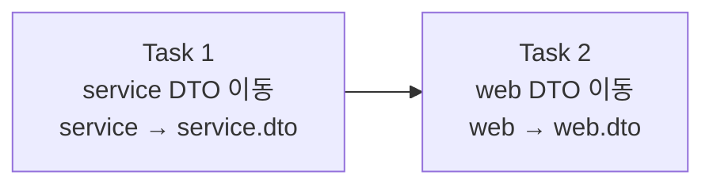

# Story 1 — Task 목록

선행: [../stories.md](../stories.md) §Story 1

## 전체 흐름

레이어별로 분리 — service 먼저 닫은 뒤 web을 건드린다. 각 Task 완료 시 전체 테스트 통과로 검증.

---

## Task 1 — service DTO → service.dto

### 목표

`service` 패키지에 흩어진 Command·Result DTO를 `service.dto` 서브패키지로 이동하고, import를 갱신한다.

### 핵심 작업

- `ReceiveCommand`, `ReceiveResult`, `ShipCommand`, `ShipResult` → `service.dto`로 이동 (패키지 선언 + 파일 위치)
- `ReceiveService`, `ShipService`, `ReceiveServiceTest`, `ShipServiceTest` import 갱신

### 이 Task에서 하지 않을 것

- web 레이어 DTO 이동 (Task 2)
- 신규 DTO 추가

### 완료 기준

- 4개 DTO가 `service.dto` 패키지에 있는 상태
- 전체 테스트 통과인 상태

---

## Task 2 — web DTO → web.dto

### 목표

`web` 패키지에 흩어진 Request·Response DTO를 `web.dto` 서브패키지로 이동하고, import를 갱신한다.

### 핵심 작업

- `ReceiveRequest`, `ReceiveResponse`, `ShipmentRequest`, `ShipmentResponse` → `web.dto`로 이동
- `ProductController`, `ProductReceiveControllerTest`, `ProductShipControllerTest` import 갱신

### 이 Task에서 하지 않을 것

- service 레이어 DTO 이동 (Task 1에서 완료)
- 신규 DTO 추가

### 완료 기준

- 4개 DTO가 `web.dto` 패키지에 있는 상태
- 전체 테스트 통과인 상태

---

## 다음 사이클

Story 1 완료 후 Story 2(재고 조회 엔드포인트)의 plan-tasks로.
