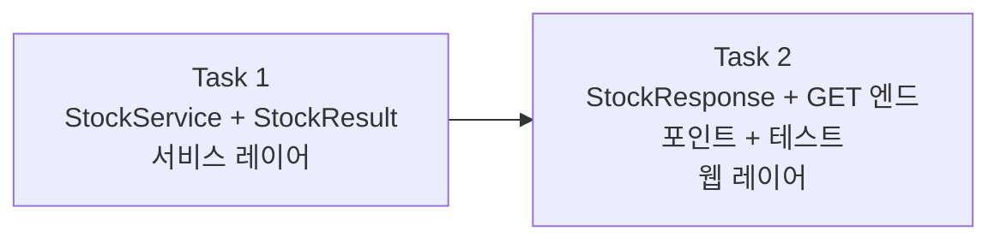

# Story 2 — Task 목록

선행: [../stories.md](../stories.md) §Story 2

## 전체 흐름

서비스 먼저 닫은 뒤 웹 레이어를 얹는다 — 입출고와 같은 레이어 순서.

---

## Task 1 — StockService + StockResult

### 목표

재고 조회 전용 서비스를 추가한다. `productId`(String)로 상품을 조회해 현재 수량을 반환한다. 상품이 없으면 `ProductNotFoundException`을 던진다.

### 핵심 작업

- `service.dto.StockResult(int quantity)` 추가
- `StockService.query(String productId)` 추가 — `ProductRepository.findByProductId` 조회 후 `StockResult` 반환, 없으면 `ProductNotFoundException`

### 이 Task에서 하지 않을 것

- 컨트롤러 엔드포인트 (Task 2)

### 완료 기준

- `StockService.query(productId)` 호출 시 현재 수량을 담은 `StockResult`가 반환되는 상태
- 미등록 `productId` 요청 시 `ProductNotFoundException`이 던져지는 상태

---

## Task 2 — StockResponse + GET 엔드포인트 + 테스트

### 목표

`GET /api/products/{productId}` 엔드포인트를 추가하고 슬라이스 테스트로 검증한다.

### 핵심 작업

- `web.dto.StockResponse(int quantity)` 추가
- `ProductController`에 `GET /api/products/{productId}` 추가 — `StockService.query()` 호출 후 `StockResponse` 반환
- `ProductStockControllerTest` 슬라이스 테스트 추가 — 정상 조회(200), 미등록(404)

### 이 Task에서 하지 않을 것

- `StockService` 구현 (Task 1에서 완료)
- HTTP 실행 확인 (입출고 에픽에서 완료된 패턴, 이번은 생략)

### 완료 기준

- `GET /api/products/{productId}` 호출 시 200 + 현재 수량 응답인 상태
- 미등록 `productId` 요청 시 404 응답인 상태
- 컨트롤러 슬라이스 테스트 통과인 상태

---

## 다음 사이클

Story 2 완료 후 Story 3(시나리오 동기화)은 비코딩 Story — plan-tasks 없이 바로 execute-task로.
