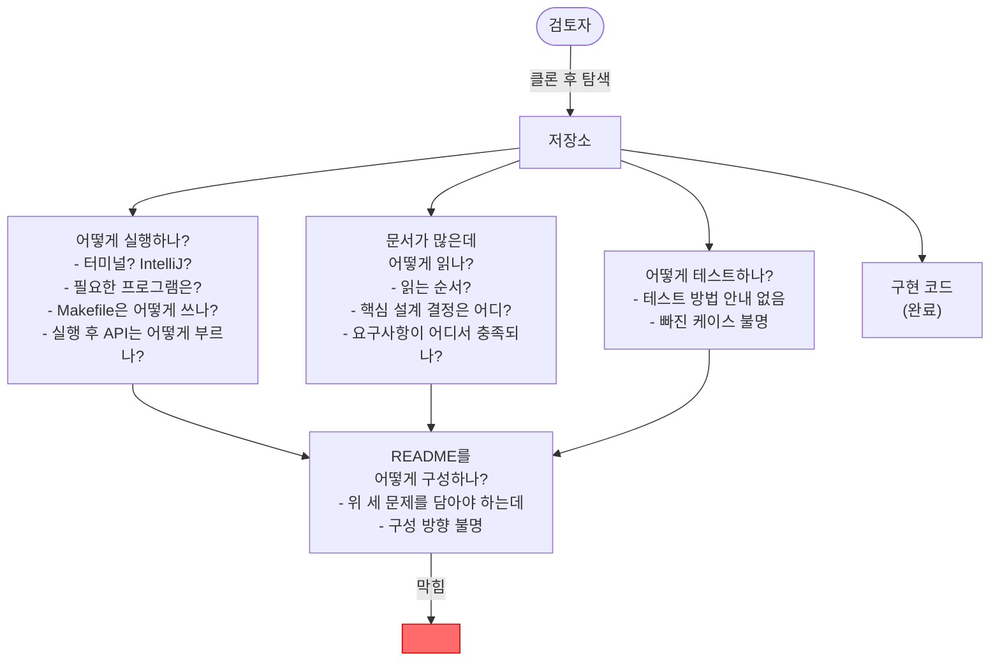

# 제출 정비 — 문제 정의 (AS-IS)

## AS-IS 다이어그램

## 흐름 설명

검토자가 저장소를 받아 탐색을 시작하면 세 갈래에서 막힌다. 실행을 시도하면 어떤 환경에서 어떤 프로그램으로 돌리는지 알 수 없고, 실행에 성공해도 API를 어떻게 호출하는지 알 수 없다. 문서를 열면 양은 많은데 어디서부터 읽어야 하는지, 핵심 설계 결정이 어디 있는지, 요구사항이 구현 어디서 충족되는지 길을 찾기 어렵다. 테스트를 돌리려 해도 방법 안내가 없고, 어떤 케이스가 검증됐는지도 불분명하다.

세 갈래의 물음표가 모두 README 한 장으로 모여야 하는데, 그 README를 어떻게 구성해야 하는지 자체도 정의되지 않은 상태다. 구현 코드만 완료된 채로 네 갈래가 모두 막혀 있다.

## 컴포넌트 설명

- **검토자** — 저장소를 받아 실행·검토하는 평가 주체. 코드보다 README와 실행 경험을 먼저 마주한다.
- **저장소** — 코드·테스트·문서가 모두 담긴 제출 단위. 검토자의 첫 진입점.
- **구현 코드** — 출고·입고·동시성·재고 조회까지 완료된 상태. 이 자리는 문제가 없다.
- **어떻게 실행하나?** — 실행 환경(터미널·IntelliJ), 필요한 프로그램(Java·Docker 등), Makefile 사용법, 실행 후 API 호출 방법이 모두 불명인 상태.
- **문서가 많은데 어떻게 읽나?** — ADR·modeling·시나리오 문서가 `docs/` 안에 있지만 읽는 순서·진입점이 없다. 핵심 설계 결정이 어디 있는지, 요구사항이 구현 어디서 충족되는지도 연결이 없다.
- **어떻게 테스트하나?** — 테스트 실행 방법 안내가 없고, 단위·슬라이스·영속 테스트 외에 빠진 케이스가 있는지도 확인되지 않은 상태.
- **README를 어떻게 구성하나?** — 세 물음표를 한 장에 담아야 하는데, 어떤 순서로 무엇을 얼마나 써야 하는지 구성 방향이 없다. 세 문제가 수렴하는 최종 막힘 지점.
