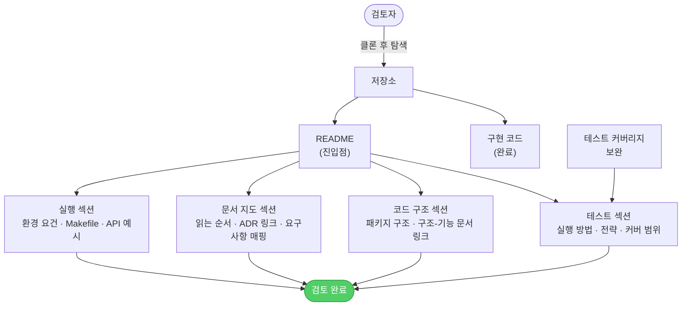

# 해결 방향 — 제출 정비 (TO-BE)

## 흐름 설명

AS-IS에서 세 갈래로 막혔던 흐름이 README 한 장을 중심으로 수렴된다. 검토자가 저장소를 클론하면 README가 첫 진입점 역할을 하며, 실행·문서·코드 구조·테스트 네 갈래의 물음표에 각각 대응하는 섹션으로 안내한다.

실행 섹션은 환경 요건(Java·Docker 버전)과 Makefile 명령어 목록, API 호출 예시(curl)를 담아 검토자가 로컬에서 바로 앱을 띄우고 API를 호출할 수 있게 한다. 문서 지도 섹션은 읽는 순서와 진입점, 핵심 ADR 링크, 요구사항과 구현의 연결 지점을 안내해 문서 더미 앞에서 방향을 잃지 않게 한다. 코드 구조 섹션은 패키지 구조를 짧게 설명하고 구조-기능 문서 링크를 달아, 검토자가 구현 코드에서 어디서부터 읽어야 하는지 찾을 수 있게 한다. 테스트 섹션은 실행 방법과 테스트 전략 요약, 커버 범위를 담는데, 이 섹션을 채우기 전에 테스트 커버리지 보완이 선행된다 — 빠진 케이스를 먼저 확인·추가한 뒤 그 범위를 문서에 적는다.

네 섹션이 갖춰지면 검토자는 실행·코드·문서·테스트 어디서든 막힘 없이 검토를 완료할 수 있다.

## 컴포넌트 설명

- **검토자** — 저장소를 받아 실행·검토하는 평가 주체. AS-IS에선 세 갈래에서 막혔지만, TO-BE에선 README가 각 물음에 바로 답을 가리켜준다.
- **저장소** — 코드·테스트·문서가 담긴 제출 단위. AS-IS와 동일하지만 이제 README가 진입점으로 서 있다.
- **README** — 검토자의 첫 착지점. 네 섹션을 통해 실행·문서·코드 구조·테스트 흐름 전체를 안내한다.
- **실행 섹션** — 환경 요건(Java·Docker 버전), Makefile 명령어 목록, API 호출 예시(curl)를 담는 구획. AS-IS에서 실행 방법을 알 수 없던 막힘을 직접 푼다.
- **문서 지도 섹션** — docs/ 안의 읽는 순서·진입점, 핵심 ADR 링크, 요구사항과 구현의 연결 지점을 담는 구획. AS-IS에서 문서 더미 앞에서 길을 잃던 막힘을 직접 푼다.
- **코드 구조 섹션** — 패키지 구조를 짧게 설명하고 구조-기능 문서 링크를 다는 구획. 검토자가 구현 코드에 진입할 때 어디서부터 읽어야 하는지 찾을 수 있게 한다.
- **테스트 커버리지 보완** — README 작성에 앞서 진행하는 코드 작업. 빠진 테스트 케이스를 확인하고 추가한다. 이 작업이 끝나야 테스트 섹션의 "커버 범위"를 정확히 쓸 수 있다.
- **테스트 섹션** — 테스트 실행 방법, 테스트 전략 요약(단위·슬라이스·영속), 검증된 커버 범위를 담는 구획. AS-IS에서 테스트 방법과 커버 범위를 알 수 없던 막힘을 직접 푼다.
- **구현 코드** — 출고·입고·동시성·재고 조회까지 완료된 상태. AS-IS와 동일하게 문제 없는 노드.
