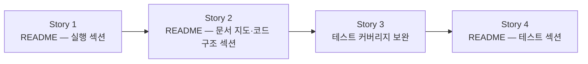

# 제출 정비 — Story 목록

선행: [../2-explore/explore-solutions.md](../2-explore/explore-solutions.md)

## 전체 흐름

README를 먼저 열고 내용을 채워가는 순서로 간다. 실행 섹션으로 README를 만들고(S1), 문서·코드 구조 안내를 더한 뒤(S2), 테스트 커버리지를 확인·보완하고(S3), 그 결과를 README 테스트 섹션에 옮겨 닫는다(S4). S3→S4는 하드 의존이다 — 커버 범위가 확정돼야 테스트 섹션을 정확히 쓸 수 있다.

## Story 1 — README 실행 섹션

### 목적

검토자가 로컬에서 앱을 띄우고 API를 호출하기까지의 흐름을 README 한 섹션으로 담는다. 환경 요건·Makefile 명령어·API 호출 예시를 순서대로 적어, 터미널만으로 따라갈 수 있게 한다.

### 실행 완료 기준

- 필요한 환경 요건(Java·Docker 버전)이 명시된다
- `make` 명령어 목록과 각 명령의 역할이 적힌다
- 앱 실행 후 주요 API를 호출하는 curl 예시가 포함된다
- README가 생성되고 실행 섹션을 순서대로 따라가면 API 응답을 확인할 수 있다

### 분해

비코딩 Story라 plan-tasks를 건너뛰고 바로 execute-task로 실행한다.

## Story 2 — README 문서 지도·코드 구조 섹션

### 목적

docs/ 문서 더미와 구현 코드 앞에서 검토자가 방향을 잡을 수 있게 안내한다. 문서는 읽는 순서·진입점·핵심 ADR 링크·요구사항 매핑으로, 코드는 패키지 구조 요약과 구조-기능 문서 링크로 표현한다.

### 실행 완료 기준

- docs/ 읽는 순서와 진입점이 명시된다
- 핵심 ADR 목록과 링크가 제공된다
- 요구사항(과제 명세)이 어느 구현에서 충족되는지 연결 지점이 보인다
- 패키지 구조가 짧게 설명되고 구조-기능 문서 링크가 달린다
- README에 두 섹션이 추가된다

### 분해

비코딩 Story라 plan-tasks를 건너뛰고 바로 execute-task로 실행한다.

## Story 3 — 테스트 커버리지 보완

### 목적

현재 단위·슬라이스·영속 테스트로 검증된 케이스 외에 빠진 시나리오를 확인하고 추가한다. 추가 범위는 다음 Story(README 테스트 섹션 길이 결정)와 맞물린다 — README에 어느 깊이까지 쓸지가 정해지면 그에 맞춰 커버리지 범위를 조정한다.

### 실행 완료 기준

- 기존 테스트 목록을 훑어 빠진 케이스(경계값·예외 흐름 등)를 식별한다
- README 테스트 섹션 길이와 맞춘 범위로 케이스를 추가하고 전체 테스트가 통과한다
- "무엇을 검증했는가"를 한눈에 볼 수 있는 상태가 된다

## Story 4 — README 테스트 섹션

### 목적

검토자가 테스트를 직접 실행하고, 어떤 전략으로 어떤 케이스를 검증했는지 파악할 수 있게 README 한 섹션으로 담는다. 이 Story에서 섹션 길이(케이스를 얼마나 상세히 나열할지)를 결정하고, 그 결정이 Story 3의 테스트 범위를 최종 조정한다. Story 3에서 확정된 커버 범위를 여기서 문서에 옮긴다.

### 실행 완료 기준

- 테스트 실행 명령이 명시된다
- 테스트 전략(단위·슬라이스·영속)이 요약된다
- Story 3에서 확정된 커버 범위(검증된 케이스 목록)가 포함된다
- README에 테스트 섹션이 추가된다

### 분해

비코딩 Story라 plan-tasks를 건너뛰고 바로 execute-task로 실행한다.
