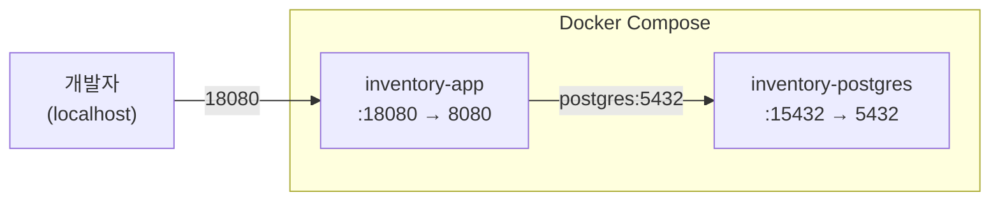

# 인프라 구조

## 설명

앱과 DB를 Docker Compose로 묶어 함께 기동·종료한다. DB 헬스체크가 통과된 뒤에만 앱이 기동되며, 앱은 컨테이너 내부 네트워크로 DB에 연결한다. 개발자는 호스트 포트(앱 18080, DB 15432)로 접근한다.

## 각 컴포넌트

- **inventory-app** — Spring Boot 앱. 호스트 18080으로 노출되며, 환경변수 `SPRING_DATASOURCE_URL`로 컨테이너 내부 DB 주소를 주입받는다.
- **inventory-postgres** — PostgreSQL 16. 호스트 15432로 노출된다. `pg_isready` 헬스체크가 통과되어야 앱 컨테이너가 기동 조건을 만족한다.
