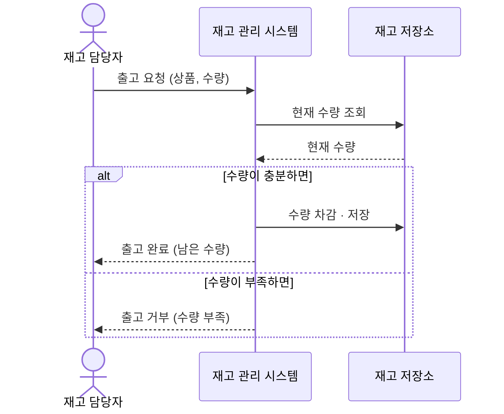
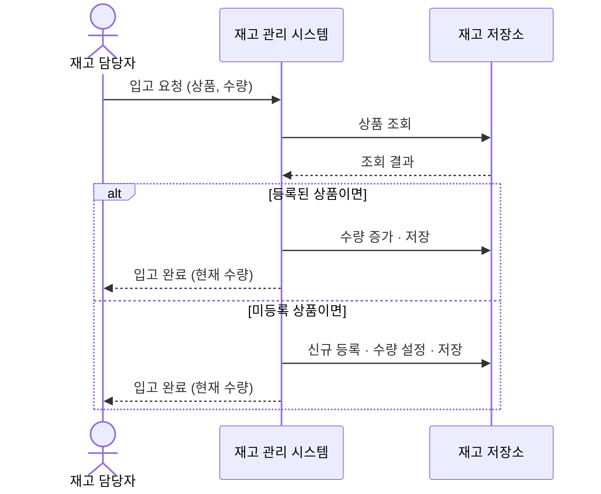
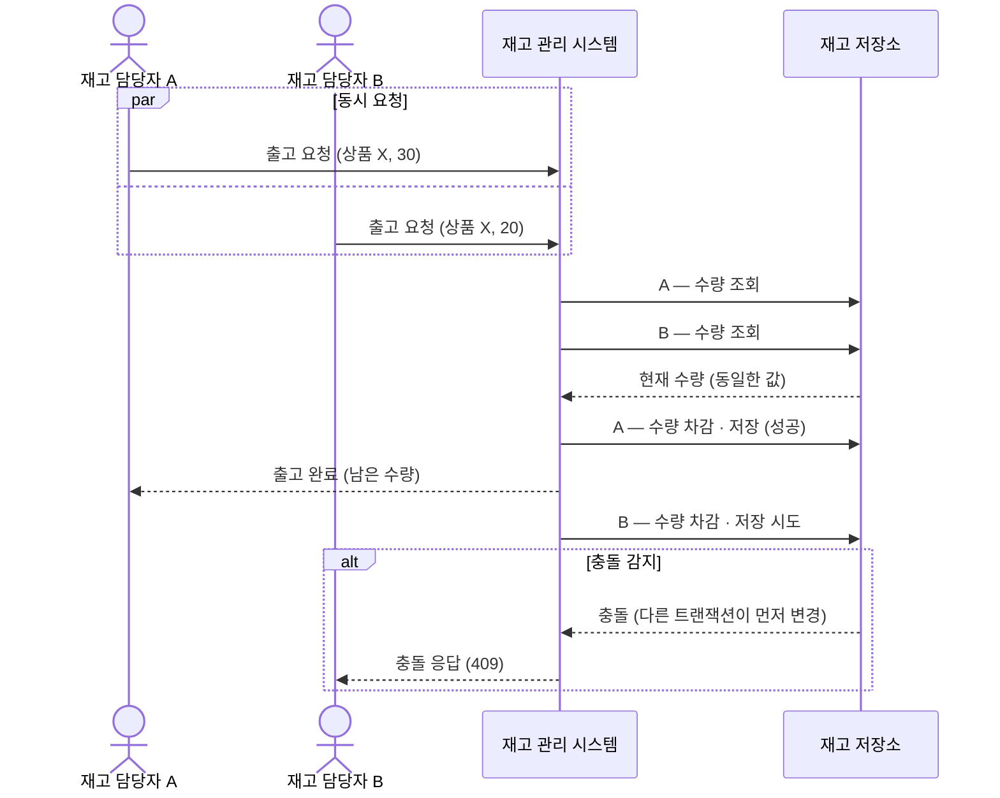
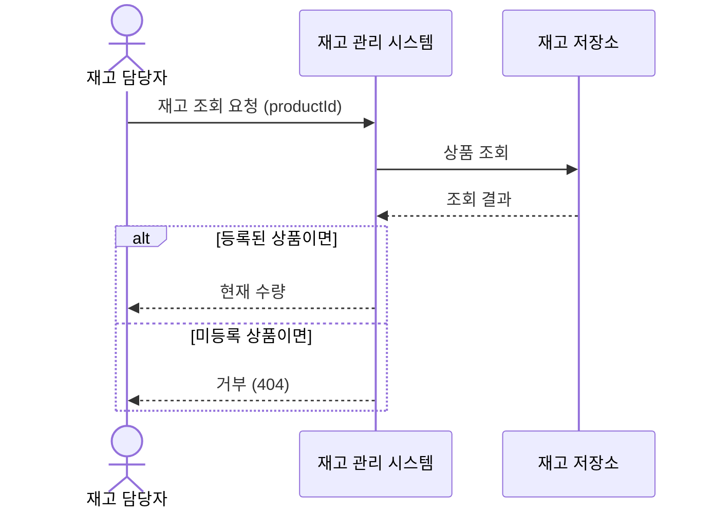

# 시나리오

재고 관리 시스템의 대표 사용 사례를 시퀀스로 그려, 이해관계자와 그들의 기대가 실제 흐름 안에서 빠짐없이 작동하는지 확인한다. 대표 시나리오만 아래에 상세히 그리고, 나머지는 코드 구현을 진행하면서 각각 완성한다.

## 시나리오 목록

- **출고 처리** (아래 상세) — 담당자가 출고하면 수량이 줄고, 수량이 부족하면 거부한다
- **입고 처리** (아래 상세) — 담당자가 입고하면 수량이 늘고, 미등록 상품이면 신규 등록 후 입고한다
- **동시 수량 변경 충돌** (아래 상세) — 두 담당자가 같은 상품을 동시에 변경해도 수량이 정확히 유지된다 (동시성 제어의 핵심)
- **재고 조회** — 담당자가 상품의 현재 수량을 확인한다
- **변동 이력 조회** — 관리자가 언제·무엇이·얼마나 들고 났는지 확인한다

## 출고 처리

### 흐름 설명

재고 담당자가 상품과 수량을 담아 출고를 요청하면, 시스템은 먼저 현재 수량을 읽어 요청 수량을 댈 수 있는지 본다. 충분하면 수량을 차감하고 남은 수량을 응답한다. 부족하면 수량을 건드리지 않고 거부로 닫는다.

### 흐름 특유의 모양

- 쓰기 전에 반드시 현재 수량을 읽어 검증한다 — *읽기 → 검증 → 쓰기*가 한 묶음이고, 바로 이 지점이 동시성 제어가 필요한 곳이다
- 수량 부족도 정상 흐름의 한 갈래다 — 예외가 아니라 거부 응답으로 닫힌다

## 입고 처리

### 흐름 설명

재고 담당자가 상품과 수량을 담아 입고를 요청하면, 시스템은 먼저 해당 상품이 등록되어 있는지 본다. 등록된 상품이면 수량을 더하고, 미등록 상품이면 name과 함께 새로 등록한 뒤 수량을 설정해 입고를 완결한다. 두 경로 모두 현재 수량을 응답으로 돌려준다.

### 흐름 특유의 모양

- 상품 존재 여부를 먼저 확인하고 경로를 가른다 — *조회 → 분기(기존/신규) → 저장*이 한 트랜잭션 안에서 돈다
- 신규 등록과 수량 증가가 입고 한 요청 안에서 완결된다 — 미등록 상품을 사전에 등록하는 별도 흐름이 없다

## 동시 수량 변경 충돌

### 흐름 설명

두 담당자가 같은 상품에 동시에 출고를 요청하면, 두 트랜잭션이 같은 수량을 읽고 각자 차감을 시도한다. 한 쪽이 먼저 저장하면 나머지는 충돌을 감지하고 409로 응답하며 닫힌다. 

### 흐름 특유의 모양

- 두 트랜잭션이 같은 수량을 읽는 순간이 충돌의 씨앗이다 — *읽기·쓰기 사이의 간격*에서 lost update가 발생한다
- 시스템이 충돌을 먼저 탐지해야 한다 — 탐지 없이 덮어쓰면 한 트랜잭션의 변경이 사라진다
- 충돌한 요청은 409로 닫는다 — 재시도는 호출자 몫이다 (ADR-012)

## 재고 조회

### 흐름 설명

재고 담당자가 `productId`를 담아 조회를 요청하면, 시스템은 해당 상품을 찾아 현재 수량을 돌려준다. 미등록 상품이면 404로 닫는다.

### 흐름 특유의 모양

- 읽기 전용 — 수량을 건드리지 않아 동시성 제어가 필요 없다
- 상품 부재는 404로 닫는다 — 입고처럼 자동 등록하지 않는다
