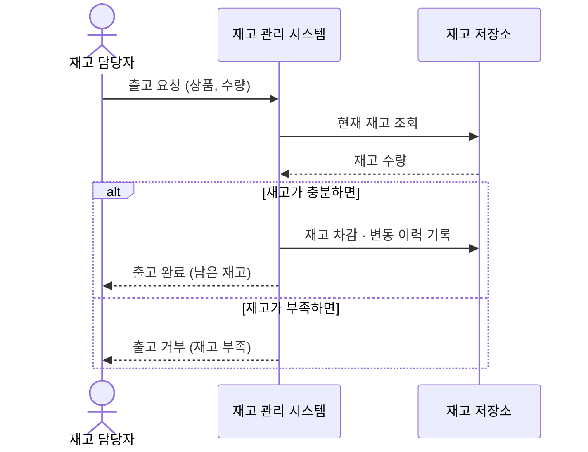
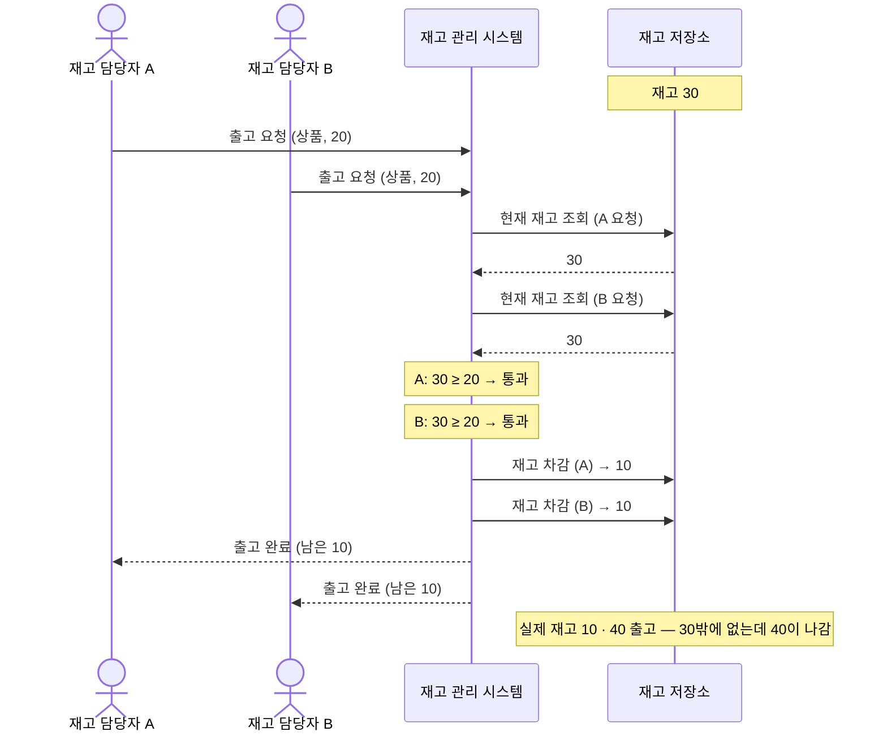

# 시나리오

재고 관리 시스템의 대표 사용 사례를 시퀀스로 그려, 이해관계자와 그들의 기대가 실제 흐름 안에서 빠짐없이 작동하는지 확인한다.

## 시나리오 목록

- **출고 처리** (대표 — 아래 상세) — 담당자가 출고하면 재고가 줄고, 재고가 부족하면 거부한다
- **동시 재고 변경 충돌** (아래 상세) — 두 담당자가 같은 상품을 동시에 변경해도 재고 수량이 정확히 유지된다 (동시성 제어의 핵심)
- **입고 처리** — 담당자가 입고하면 재고가 늘고 변동 이력이 남는다
- **재고 조회** — 담당자가 상품의 현재 재고를 확인한다
- **변동 이력 조회** — 관리자가 언제·무엇이·얼마나 들고 났는지 확인한다
- **상품 등록** — 담당자가 관리할 새 상품을 등록한다

## 출고 처리

### 흐름 설명

재고 담당자가 상품과 수량을 담아 출고를 요청하면, 시스템은 먼저 현재 재고를 읽어 요청 수량을 댈 수 있는지 본다. 충분하면 재고를 차감하고 그 변동을 이력으로 남긴 뒤 남은 재고를 응답한다. 부족하면 재고를 건드리지 않고 거부로 닫는다.

### 흐름 특유의 모양

- 쓰기 전에 반드시 현재 재고를 읽어 검증한다 — *읽기 → 검증 → 쓰기*가 한 묶음이고, 바로 이 지점이 동시성 제어가 필요한 곳이다
- 재고를 바꿀 때는 변동 이력을 함께 남긴다 — 재고 수량과 이력이 늘 같이 움직인다
- 재고 부족도 정상 흐름의 한 갈래다 — 예외가 아니라 거부 응답으로 닫힌다

## 동시 재고 변경 충돌

### 흐름 설명

재고 30인 상품에 두 담당자가 거의 동시에 20씩 출고를 요청한다. 시스템이 각 요청의 재고를 따로 읽는 사이 아직 아무도 차감하지 않아, 둘 다 30을 보고 "20은 댈 수 있다"며 검증을 통과한다. 이어 각자 차감하면 한쪽 갱신이 다른 쪽을 덮어써 재고는 10으로만 떨어지고, 30밖에 없던 상품이 40 출고된다. 한 요청은 거부됐어야 했다.

### 흐름 특유의 모양

- 읽기와 쓰기 사이에 다른 요청이 끼어든다 — 검증할 때 본 재고와 차감할 때의 재고가 다를 수 있다
- 깨지는 기대가 두 겹이다 — 재고 정확 유지(lost update)와 초과 출고 방지가 함께 무너진다
- 동시성 제어 방식은 재고 저장 모델에 따라 달라진다 — 수량 컬럼이면 lost update, 이력 합산이면 write-skew까지 고려해야 한다
- 입고가 섞인 조합(입고+출고, 입고+입고)도 같은 read-modify-write race다 — lost update는 동일하게 발생하고, 초과 출고만 출고가 껴야 생긴다
