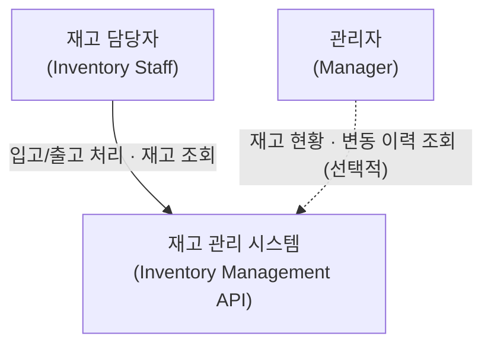

# 이해관계자

재고 관리 시스템을 사용하는 이해관계자와 이들이 무엇을 기대하는지 정리한다.

## 설명

과제 필수 범위에서 시스템을 직접 사용하는 사람은 재고 담당자다 — 입고·출고, 재고 조회를 한다. 관리자는 재고 현황과 변동 이력을 보는 청중인데, 변동 이력 자체가 과제 필수가 아니라 자유 추가 영역이라 *변동 이력을 더할 때 등장하는 선택적 청중*이다. 둘의 차이는 하는 일에 있다 — 담당자는 재고를 바꾸고, 관리자는 바뀐 결과를 본다.

외부 시스템(주문·판매, 발주·공급)은 과제가 그 자체로 완결된다면 필요 없을 수 있어 지금은 뺐다. 요구사항을 확인해 연동할 시스템이 생기면 그때 추가한다.

## 각 이해관계자

- **재고 담당자 (Inventory Staff)**
  - 입고·출고한 수량이 재고에 그대로 반영되고, 현재 재고를 바로 확인할 수 있다 — 재고가 정확해야 운영이 돌아간다
  - 여러 담당자가 동시에 입출고해도 재고 수량이 정확히 유지된다 — 동시에 접근하면 재고가 어긋날 수 있다 (lost update · 초과 출고)
- **관리자 (Manager)** *(선택적 확장)* — 언제 무엇이 얼마나 들고 났는지 변동 이력으로 확인한다 — 재고가 안 맞을 때 원인을 찾아야 하기 때문
