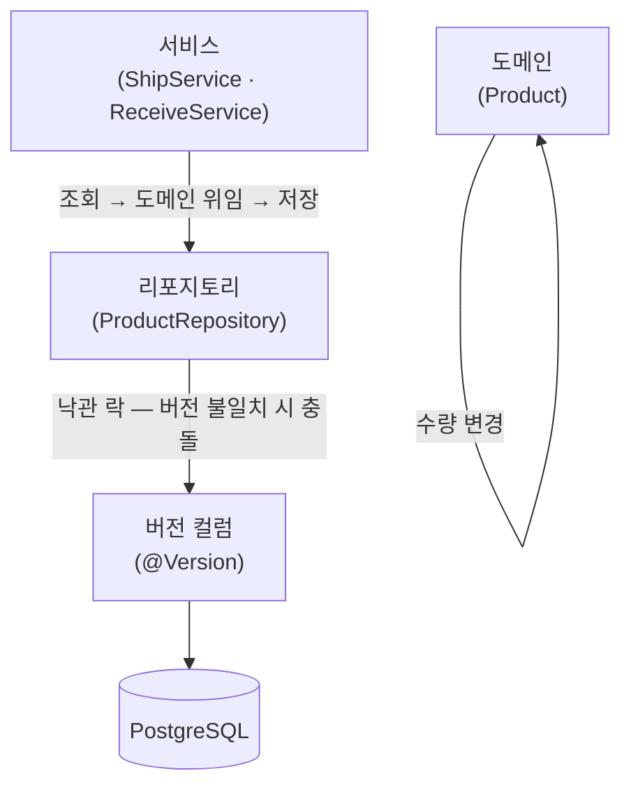

# 동시성 제어 구현 — 계층 구조

## 설명

낙관 락(`@Version`)을 `Product`에 추가해 동시 수량 변경을 제어한다. 두 트랜잭션이 같은 상품을 동시에 읽고 변경을 시도할 때, JPA가 저장 시점에 버전을 비교해 먼저 저장한 쪽은 통과시키고 나머지는 `ObjectOptimisticLockingFailureException`을 던진다. 예외 핸들러가 409 Conflict로 응답하고 닫는다.

비관 락(`SELECT … FOR UPDATE`)도 후보였으나 낙관 락을 선도입한다 — 충돌 빈도 데이터가 없는 상태에서 먼저 운용하며 충돌 예외 빈도를 수집하고, 잦아지면 비관 락으로 전환한다 ([ADR-012](../adr/adr-012-optimistic-locking.md)).

## 각 컴포넌트

- **`@Version` 컬럼 (Product)** — JPA가 관리하는 버전 필드. 저장 시 `WHERE id = ? AND version = ?`로 조건을 걸어 버전이 바뀌었으면 업데이트 행 수가 0이 되고 JPA가 충돌로 판단한다.
- **서비스 (ShipService · ReceiveService)** — 코드 변경 없음. 낙관 락 충돌은 JPA·Spring Data가 투명하게 처리한다. 충돌 시 `ObjectOptimisticLockingFailureException`이 트랜잭션 바깥으로 전파된다.
- **예외 핸들러 (ApiExceptionHandler)** — `ObjectOptimisticLockingFailureException`을 409 Conflict로 매핑한다. 재시도는 과제 범위 밖이므로 409로 응답하고 닫는다.
- **리포지토리 (ProductRepository)** — 변경 없음. 낙관 락은 JPA 레벨에서 동작한다.
