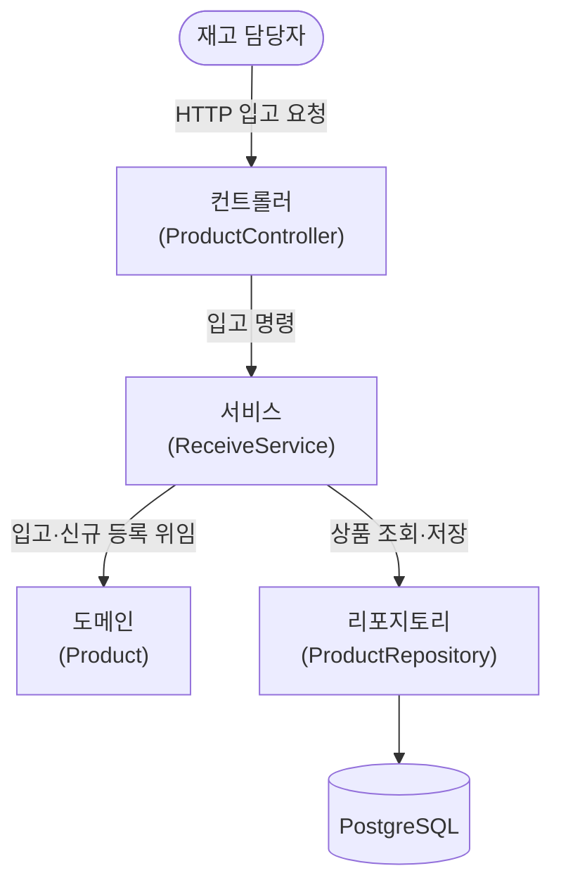

# 입고 구현 — 계층 구조

## 설명

출고와 같은 레이어드 구조다. 컨트롤러는 HTTP를, 서비스는 find-or-create 오케스트레이션을, 도메인은 입고 규칙을, 리포지토리는 영속을 맡는다.

핵심은 **서비스의 find-or-create**다. `productId`로 상품을 조회해 있으면 수량을 증가시키고, 없으면 `name`과 함께 신규 등록한 뒤 입고한다. 두 경로 모두 도메인 `receive()`를 태워 불변식 검증을 재사용한다.

## 각 컴포넌트

- **컨트롤러 (ProductController)** — HTTP 입고 요청을 받아 서비스를 태우고, 입고 후 현재 수량을 200으로 응답한다.
  - **요청·응답 DTO (ReceiveRequest · ReceiveResponse)** — 요청은 productId·name·quantity를 필수로 받고, 0·음수·blank를 400으로 끊는다. 응답은 입고 후 현재 수량.
  - **예외 핸들러 (ApiExceptionHandler · ErrorResponse)** — 검증 실패 → 400 (출고와 공유).
- **서비스 (ReceiveService)** — 입고 오케스트레이션. productId로 조회해 있으면 수량 증가, 없으면 name과 함께 신규 등록 후 입고. 저장까지 한 `@Transactional` 안에서 완결.
  - **입력·결과 (ReceiveCommand · ReceiveResult)** — 웹·영속을 모르는 서비스 전용 타입.
- **도메인 (Product)** — 입고 규칙을 집행한다. 수량을 증가시키고, 0·음수는 `IllegalArgumentException`. 신규 상품은 수량 0으로 생성 후 `receive()`를 태워 불변식을 거친다.
- **리포지토리 (ProductRepository)** — productId로 상품을 조회·저장한다. 출고와 같은 리포지토리를 공유한다.
