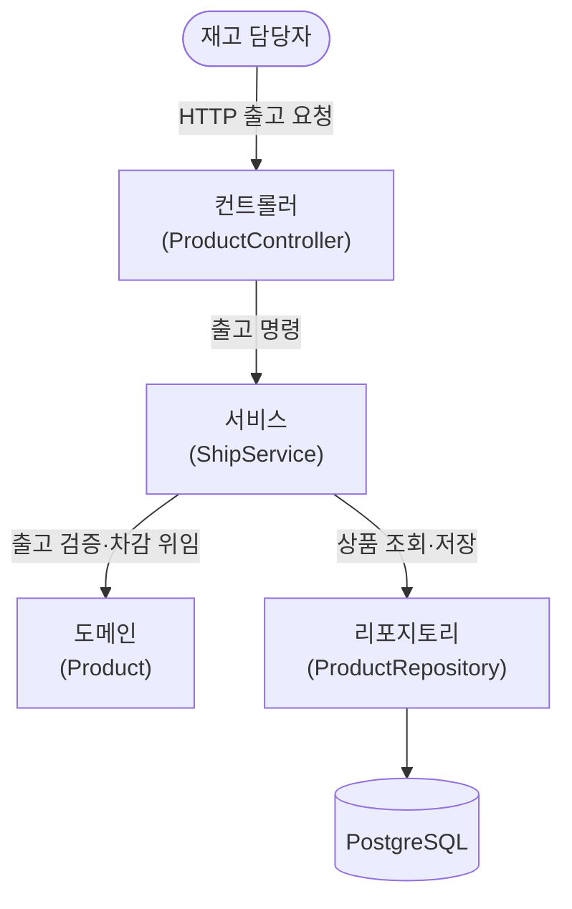

# 출고 구현 — 계층 구조

## 설명

기술 계층(레이어드)으로 나눴다 — 위에서 아래로 의존이 한 방향으로만 흐른다. 컨트롤러는 HTTP를, 서비스는 한 트랜잭션 안의 오케스트레이션을, 도메인은 출고 규칙을, 리포지토리는 영속을 맡는다. 바깥 계층은 안쪽을 알아도 안쪽은 바깥을 모른다.

핵심 분업은 **서비스와 도메인 사이**에 있다. 서비스는 *순서*(상품을 조회해 도메인에 태우고, 성공이면 저장한다)를 엮을 뿐, *출고가 되는가*의 판단은 도메인(`Product`)이 쥔다. 충분하면 차감하고, 부족하면 거부하고, 잘못된 수량은 막는 규칙이 전부 도메인 안에 있다.

## 각 컴포넌트

- **컨트롤러 (ProductController)** — HTTP 출고 요청을 받아 서비스를 태우고, 성공 200·부족 409를 인라인 매핑한다(부족은 예외가 아닌 정상 분기).
  - **요청·응답 DTO (ShipmentRequest · ShipmentResponse)** — 요청은 `@Valid`로 빈 productId·0·음수를 400으로 끊고, 응답은 남은 수량을 싣는다.
  - **예외 핸들러 (ApiExceptionHandler · ErrorResponse)** — 예외를 HTTP로 매핑한다: 상품 없음 → 404, 검증 실패 → 400.
- **서비스 (ShipService)** — 출고 오케스트레이션. 조회 → 도메인 `ship` → (성공 시) 저장을 한 `@Transactional` 안에서 돌리고, 조회 실패면 `ProductNotFoundException`을 던진다.
  - **입력·결과 (ShipCommand · ShipResult)** — 웹·영속을 모르는 서비스 전용 입력·결과 타입.
- **도메인 (Product)** — 출고 규칙을 집행한다. 충분하면 차감·`SUCCESS`, 부족하면 `INSUFFICIENT`(반환값), 0·음수는 `IllegalArgumentException`. 도메인에 JPA를 직접 매핑한다 (ADR-004).
  - **ShipmentResult** — 출고 결과(성공·부족) enum.
- **리포지토리 (ProductRepository)** — productId로 상품을 조회·저장한다. JPA로 PostgreSQL에 영속한다.
