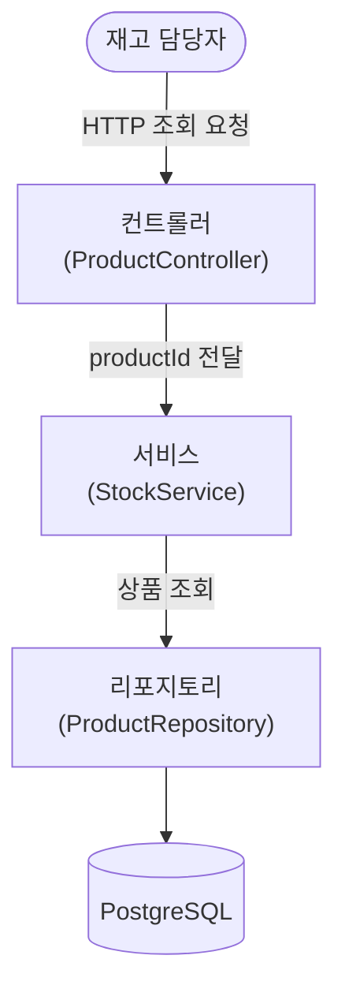

# 재고 조회 구현 — 계층 구조

## 설명

읽기 전용 유스케이스라 도메인을 거치지 않는다. 서비스가 리포지토리에서 상품을 조회해 현재 수량을 그대로 반환한다. 쓰기가 없어 트랜잭션 격리나 낙관 락이 필요 없다.

## 각 컴포넌트

- **컨트롤러 (ProductController)** — `GET /api/products/{productId}` 요청을 받아 서비스를 태우고, 현재 수량을 200으로 응답한다. 미등록 상품은 `ApiExceptionHandler`가 404로 변환한다.
  - **응답 DTO (StockResponse)** — 현재 수량(quantity) 하나를 싣는다.
- **서비스 (StockService)** — `productId`로 상품을 조회해 `StockResult`로 돌려준다. 상품이 없으면 `ProductNotFoundException`을 던진다.
  - **결과 (StockResult)** — 서비스 전용 반환 타입.
- **리포지토리 (ProductRepository)** — `findByProductId`로 상품을 조회한다. 입출고와 같은 리포지토리를 공유한다.
