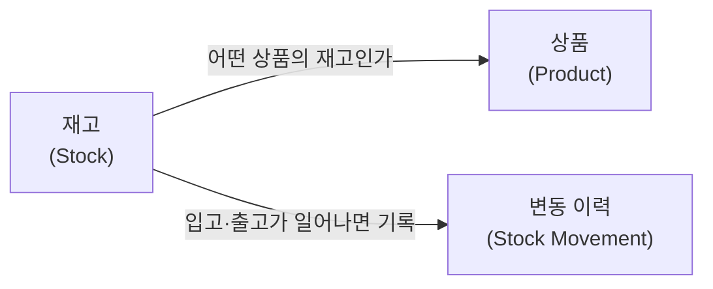

# 시스템 내부 구조

재고 관리 시스템 내부를 도메인 개념 단위로 나누고, 각 컴포넌트가 무슨 책임을 지는지 정의한다.

## 설명

기술 계층(요청 처리·저장 등)이 아니라 **도메인 개념**으로 나눴다. 재고 관리에서 다루는 대상은 셋이다 — 재고를 매기는 *상품*, 그 상품의 현재 보유량인 *재고*, 재고가 움직인 자취인 *변동 이력*. 재고는 어떤 상품의 것인지 상품을 가리키고, 재고가 입고·출고로 바뀔 때마다 변동 이력이 남는다.

세 컴포넌트 중 동시성 제어의 한가운데 있는 것은 **재고**다 — 여러 요청이 같은 상품의 보유량을 동시에 바꾸려 할 때 충돌이 생긴다.

## 각 컴포넌트

- **상품 (Product)** — 재고를 매기는 대상. 상품을 등록하고 식별·기본 정보를 들고 있다. *(재고 담당자가 관리할 상품을 등록)*
- **재고 (Stock)** — 상품별 현재 보유 수량. 입고로 늘고 출고로 줄며, 출고할 때 재고가 충분한지 검증한다. *(입출고가 정확히 반영되고 초과 출고를 막는 — 재고 담당자 기대의 핵심)*
- **변동 이력 (Stock Movement)** — 언제·어떤 상품이·얼마나·왜(입고/출고) 움직였는지 기록하고 조회하게 한다. *(관리자가 변동을 추적하는 근거)*

## 설계 근거

### 상품과 재고를 나눈 이유

상품과 재고는 서로 다른 질문에 답한다 — 상품은 "이게 *무엇*인가"(이름·SKU·규격, 거의 안 변함), 재고는 "이게 *얼마나* 있나"(수량, 입출고마다 변함).

- **변하는 속도가 다르다** — 거의 고정된 상품 정보와, 시스템에서 가장 자주 변하는 재고 수량을 한 덩어리에 묶지 않는다.
- **동시성 경계가 분리된다** — 재고 수량은 락·버전의 핫스팟이고 상품 정보는 아니다. 나누면 동시성 제어를 재고에만 좁게 가둘 수 있다.
- **개수 관계가 1:1이 아닐 수 있다** — 한 상품이 여러 위치(창고)에 재고를 가질 수 있다 (상품 1 : 재고 N).

단, 이건 *도메인 개념*의 분리다. 물리 저장까지 나눌지(상품 테이블에 수량 컬럼을 합칠지)는 저장 모델을 정할 때 결정한다. 개념을 구분해두면 저장은 합치든 나누든 선택지가 열린다.

### 변동 이력을 History가 아닌 Movement로 둔 이유

- **History** — *상태의 스냅샷 기록*("그때 재고가 얼마였나")에 가깝다.
- **Movement** — *재고를 바꾼 사건*("+50 입고 / −20 출고, 언제·왜")을 가리킨다.

재고를 바꾼 것은 사건이므로 사건 자체를 사실의 원천으로 둔다. 현재 재고는 이 사건들을 합산해 끌어낼 수 있고, 방향(±)·수량·사유가 함께 남아 관리자가 변동을 추적할 수 있다. 상태 스냅샷(History)은 사건에서 파생되는 결과라 원천으로 두지 않는다.

## 열린 설계 결정

- **재고 저장 모델** — 재고를 수량 컬럼으로 직접 들지, 변동 이력을 쌓아 합산할지. 이 선택이 *재고와 변동 이력의 관계*(별개냐, 이력에서 파생되냐)와 동시성 제어 기법을 함께 가른다.
  - 합산 방식의 극단으로 **이벤트 소싱**(저장된 수량을 두지 않고 재고를 변동 이벤트 스트림의 프로젝션으로 둠)도 가능하다. 감사 추적·시점 조회가 강점이지만, 재생·프로젝션·스트림 버전 관리라는 복잡도가 따라온다.
- **동시성 제어 기법** — 비관적 락 / 낙관적 버전 / 격리 수준 중 무엇으로 lost update·초과 출고(·필요 시 write-skew)를 막을지.
