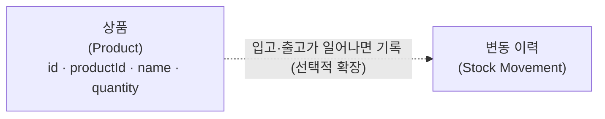

# 시스템 내부 구조

재고 관리 시스템 내부를 도메인 개념 단위로 나누고, 각 컴포넌트가 무슨 책임을 지는지 정의한다.

## 설명

기술 계층이 아니라 **도메인 개념**으로 나눴다. 핵심은 **상품** 하나다 — 식별 정보(productId·name)와 현재 보유 수량(quantity)을 한 애그리거트가 직접 든다. *변동 이력*은 재고 변동의 자취를 남기는 선택적 확장이다.

동시성 제어의 한가운데는 **수량**이다 — 같은 상품의 보유량을 여러 요청이 동시에 바꾸려 할 때 충돌이 생긴다.

## 각 컴포넌트

- **상품 (Product)** — 재고를 매기는 대상이자 현재 보유 수량을 직접 드는 단일 애그리거트. 입고로 수량이 늘고, 출고로 줄며, 초과 출고를 막는다. 미등록 상품은 입고 시 name과 함께 신규 등록된다.
- **변동 이력 (Stock Movement)** *(선택적 확장)* — 언제·어떤 상품이·얼마나·왜(입고/출고) 움직였는지 기록하고 조회하게 한다.

## 설계 근거

### 상품이 수량을 직접 드는 이유

과제 데이터 구조 `{id, name, quantity}`는 상품이 수량을 직접 드는 단일 애그리거트 구조다. 입고·출고가 모두 같은 상품 수량을 바꾸고, 동시성 제어(락·버전)도 한 엔티티에 집중되어 단순하다. 별도 재고 엔티티를 두면 조인·트랜잭션 경계가 복잡해지는 반면 지금 규모에서 얻는 이점이 없다 (ADR-009).

### 변동 이력을 History가 아닌 Movement로 둔 이유

- **History** — *상태의 스냅샷 기록*("그때 수량이 얼마였나")에 가깝다.
- **Movement** — *수량을 바꾼 사건*("+50 입고 / −20 출고, 언제·왜")을 가리킨다.

수량을 바꾼 것은 사건이므로 사건을 사실의 원천으로 둔다. 현재 수량은 사건을 합산해 끌어내고, 방향(±)·수량·사유가 남아 변동을 추적할 수 있다.

## 열린 설계 결정

- **동시성 제어 기법** — lost update·초과 출고(·필요 시 write-skew)를 무엇으로 막을지. DB는 PostgreSQL(MVCC)로 고정이라 선택지도 그 위에서 — 행 락(`SELECT … FOR UPDATE`) / 낙관적 버전(`@Version`) / SERIALIZABLE(SSI).
- **변동 이력 저장 모델** — 변동 이력을 별도 테이블로 쌓을지, 이벤트 소싱으로 갈지. 현재 수량은 상품 테이블에 직접 들고 있어 이력은 부가 기록이다.
